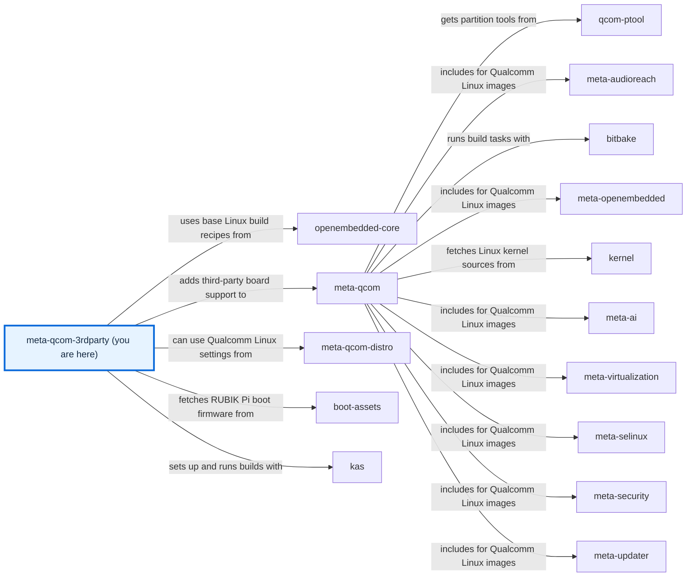

# meta-qcom-3rdparty

[)](https://github.com/qualcomm-linux/meta-qcom-3rdparty/actions/workflows/push.yml)
[)](https://github.com/qualcomm-linux/meta-qcom-3rdparty/actions/workflows/nightly-build.yml)

[)](https://github.com/qualcomm-linux/meta-qcom-3rdparty/actions/workflows/push.yml?query=branch%3Awrynose)
[)](https://github.com/qualcomm-linux/meta-qcom-3rdparty/actions/workflows/nightly-build.yml?query=branch%3Awrynose)

## Introduction

OpenEmbedded/Yocto Project BSP layer for Third-Party Maintained Qualcomm based
platforms.

This layer provides additional recipes and machine configuration files for
Third-Party Maintained Qualcomm platforms. Reference boards that are officially
supported by Qualcomm are available via `meta-qcom` instead.

This layer depends on:

```text
URI: https://github.com/openembedded/openembedded-core.git
layers: meta
branch: master
revision: HEAD

URI: https://github.com/qualcomm-linux/meta-qcom.git
branch: master
revision: HEAD
```

## First build and documentation

Prepare the [development environment](docs/source/contributing/DEVELOPMENT.md),
then select an existing board, for example:

```sh
kas-container build ci/rubikpi3.yml
```

For a smaller first output, follow the [firmware deployment tutorial](docs/source/user/USAGE.md).
Browse the [documentation source](docs/source/README.md) or open the committed
[offline documentation site](docs/site/index.html) directly from a local checkout.
The [configuration reference](docs/source/user/CONFIGURATION.md) explains kas
composition, BitBake precedence, machine variables, and CI settings.

## Branches

[Branch maintenance](BRANCHES.md) describes long-lived maintenance and merge
relationships. Upstream release guidance remains authoritative; this fork's
review branches do not change contribution ownership.

| Branch | Purpose and status | Use and contributions |
| --- | --- | --- |
| Upstream `main` | Primary development, with focus on upstream support and compatibility with the most recent Yocto release. | Build with its matching layers; normal product contributions target upstream main. |
| Upstream `wrynose` | Yocto Project 6.0 LTS, used by Qualcomm Linux 2.x. | Separate LTS builds and reviewed backports. |
| `scarthgap` in upstream/fork | Qualcomm Linux >= 1.4, aligned with Yocto 5.0 LTS. | Build matching release layers; send product fixes to upstream scarthgap. |
| `kirkstone` in upstream/fork | Qualcomm Linux <= 1.3, aligned with Yocto 4.0 LTS. | Retained release baseline; check current support and send applicable fixes upstream. |
| `next` in upstream/fork | Retained staging/development work. | Evaluate explicitly; normal product contributions go to main unless maintainers direct otherwise. |
| Fork `main` | Default fork integration branch, potentially divergent from upstream. | Review the checkout before building; fork documentation work uses its stated PR base. |
| Fork `upstream` | Upstream-derived fork review baseline. | Base for selected documentation proposals; verify its commit before rebasing. |
| `devdocs/main`, `devdocs/build`, `devdocs/s3-cache-backup` | Retained DevDocs integration, build, and cache-work topics. | Topic evaluation only; review against each proposal's stated fork base. |
| `devdocs/docs-v3`, `devdocs/generated-tutorials`, `devdocs/required-files-sphinx`, `devdocs/source-file-docs`, `docs/qli-2-tutorials` | Retained documentation and tutorial topics. | Review documentation in the selected checkout; not release build baselines. |
| `devdocs/wrynose/docs`, `devdocs/wrynose/docs-v2` | Retained wrynose documentation topics. | Use matching release layers if evaluating; documentation review uses the proposal's fork base. |
| `devdocs/imx219-cam2` | Retained camera-integration topic. | Hardware development evaluation only; approved product changes belong upstream. |
| `devdocs/vscode` | Retained editor-development topic. | Evaluate its development setup; not a release baseline. |
| `njjetha` | Retained contributor topic with no maintenance contract declared here. | Inspect its scope before use; confirm the proposal's base before contributing. |
| `radxa-dragon-q6a-hdmi`, `radxa-dragon-q6a-hdmi-cmdline-extra`, `radxa-dragon-q6a-hdmi-deferred-config`, `radxa-dragon-q6a-hdmi-uki-cmdline` | Retained Radxa HDMI and boot-command-line development topics. | Board-specific evaluation only; normal product changes are proposed upstream. |
| `test/qualcomm-upgrade-astra` | Temporary Astra xHigh repository-upgrade skill test. | Review the proposed docs and checks against fork upstream; leave this test unmerged. |

## Machine Support

See [conf/machine](conf/machine/README.md) for the complete list of supported devices
and the [machine guide](docs/source/user/SUPPORTED_MACHINES.md) for boot and firmware boundaries.

## Contributing

Follow [CONTRIBUTING.md](CONTRIBUTING.md) for setup, policy, and submission routing.
Please submit any patches against the `meta-qcom-3rdparty` layer by using
the GitHub pull-request feature. Fork the repo, create a branch,
do the work, rebase from upstream, and create the pull request.

For some useful guidelines when submitting patches, please refer to:
[Preparing Changes for Submission](https://docs.yoctoproject.org/dev/contributor-guide/submit-changes.html#preparing-changes-for-submission)

Pull requests will be discussed within the GitHub pull-request infrastructure.

## Communication

- **GitHub Issues:** [meta-qcom-3rdparty issues](https://github.com/qualcomm-linux/meta-qcom-3rdparty/issues)
- **Pull Requests:** [meta-qcom-3rdparty pull requests](https://github.com/qualcomm-linux/meta-qcom-3rdparty/pulls)
- **Security concerns:** use the [private vulnerability reporting route](SECURITY.md).
- **Conduct concerns:** follow the [Code of Conduct](CODE_OF_CONDUCT.md) and its reporting contact.

## Maintainer(s)

- Ricardo Salveti <ricardo.salveti@oss.qualcomm.com>
- Nicolas Dechesne <nicolas.dechesne@oss.qualcomm.com>

[CODEOWNERS](.github/CODEOWNERS) assigns these maintainers to code and documentation review.

## License

This layer is licensed under the MIT license. Check out [LICENSE](LICENSE) (the original [COPYING.MIT](COPYING.MIT) text)
for more details.

## Folders

- [.github](.github/) — Holds code owners, contribution templates, documentation tools, and CI workflows.
- [ci](ci/README.md) — Composes kas builds and provides CI-equivalent validation helpers.
- [conf](conf/README.md) — Declares layer discovery and supported machine configuration.
- [docs](docs/README.md) — Contains authored documentation and the committed offline website.
- [dynamic-layers](dynamic-layers/README.md) — Adds integration only when the corresponding optional layer is loaded.
- [recipes-bsp](recipes-bsp/README.md) — Supplies board boot firmware and machine packagegroups.
- [recipes-kernel](recipes-kernel/README.md) — Extends parent kernel recipes with board-specific configuration.

## Files

- [.env.example](.env.example) — Documents optional shell exports without storing credentials.
- [.gitignore](.gitignore) — Excludes local documentation tools, caches, and intermediate output.
- [AGENTS.md](AGENTS.md) — Directs automation to the complete contributor-side agent guide.
- [BRANCHES.md](BRANCHES.md) — Explains release maintenance, staging, and fork contribution relationships.
- [CODE-OF-CONDUCT.md](CODE-OF-CONDUCT.md) — Owns the original Contributor Covenant and Qualcomm reporting contact.
- [CODE_OF_CONDUCT.md](CODE_OF_CONDUCT.md) — Exposes the existing conduct policy under the standard discovery name.
- [CONTRIBUTING.md](CONTRIBUTING.md) — Directs contributors to setup, submission rules, and upstream review.
- [COPYING.MIT](COPYING.MIT) — Owns the original MIT licence text for this layer.
- [LICENSE](LICENSE) — Exposes the approved layer licence under the standard discovery name.
- [README.md](README.md) — Introduces this folder and indexes its maintained contents.
- [SECURITY.md](SECURITY.md) — Defines private vulnerability reporting and supported-fix policy.
- [THIRD_PARTY_NOTICES.md](THIRD_PARTY_NOTICES.md) — Retains notices for reused documentation infrastructure.

<!-- repository-map:start -->

## Repository map



[Full Qualcomm repository map](https://github.com/devdocsorg/qualcomm-repository-map).

<!-- Generated from https://github.com/devdocsorg/qualcomm-repository-map at b8990cbd3948b44d0a9f3dc5e1bfd0363015e443; dataset SHA-256: cb5079d4a57391600aa45ccbfb03b7d6c7124c4528a2d3976604cb11b8bdf015. -->

<!-- repository-map:end -->
