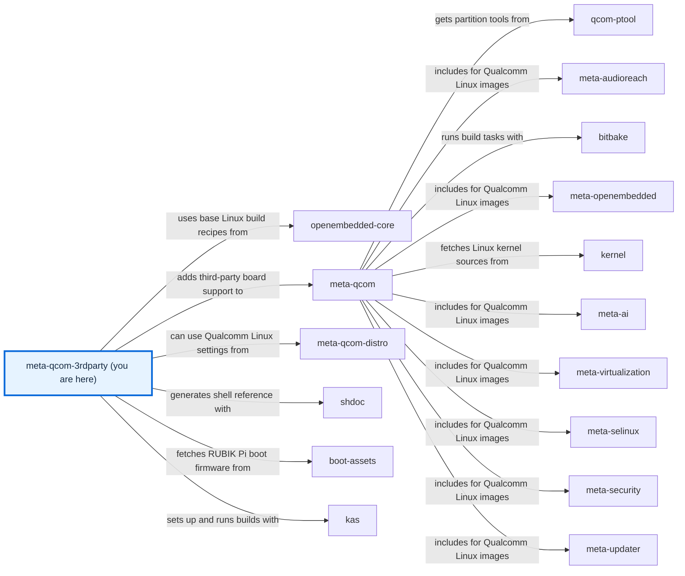

# meta-qcom-3rdparty

[)](https://github.com/qualcomm-linux/meta-qcom-3rdparty/actions/workflows/push.yml)
[)](https://github.com/qualcomm-linux/meta-qcom-3rdparty/actions/workflows/nightly-build.yml)

[)](https://github.com/qualcomm-linux/meta-qcom-3rdparty/actions/workflows/push.yml?query=branch%3Awrynose)
[)](https://github.com/qualcomm-linux/meta-qcom-3rdparty/actions/workflows/nightly-build.yml?query=branch%3Awrynose)

## Introduction

OpenEmbedded/Yocto Project BSP layer for Third-Party Maintained Qualcomm based
platforms.

This layer provides additional recipes and machine configuration files for
Third-Party Maintained Qualcomm platforms. Reference boards that are officially
supported by Qualcomm are available via [meta-qcom](https://github.com/qualcomm-linux/meta-qcom) instead.

This layer depends on:

```text
URI: https://github.com/openembedded/openembedded-core.git
layers: meta
branch: master
revision: HEAD

URI: https://github.com/qualcomm-linux/meta-qcom.git
branch: master
revision: HEAD
```

## First use and documentation

Follow the [development setup](docs/source/contributing/DEVELOPMENT.md), then build
an image with the [RUBIK Pi 3 tutorial](docs/source/user/USAGE.md). The first build
from a prepared checkout is:

```sh
"${KAS_CONTAINER:-kas-container}" shell ci/rubikpi3.yml -c 'bitbake core-image-base'
```

Open [docs/site/index.html](docs/site/index.html) directly for offline guides,
search, and native function reference. The [source homepage](docs/source/README.md)
and [configuration reference](docs/source/user/CONFIGURATION.md) are maintained
alongside the layer. Use the [issues channel](https://github.com/qualcomm-linux/meta-qcom-3rdparty/issues)
for support.

## Branches

- **main:** Primary development branch, with focus on upstream support and
  compatibility with the most recent Yocto Project release.
- **wrynose:** LTS branch based on the Yocto Project 6.0 release, used by
  Qualcomm Linux 2.x.
- **scarthgap:** Qualcomm Linux >= 1.4, aligned with Yocto Project 5.0 (LTS).
- **kirkstone:** Qualcomm Linux <= 1.3, aligned with Yocto Project 4.0 (LTS).

These descriptions refer to upstream's release lines. The
[branch maintenance guide](BRANCHES.md) explains separate maintenance and the
fork/upstream relationship; its adopted canonical home is `main`. Upstream also
has `next`, an integration branch with no documented release contract: use it only
at maintainers' direction and submit ordinary changes to upstream `main`.

The DevDocs fork currently exposes the following branches. Topic purposes below
reflect their names; no tested release status or merge commitment is asserted.
Use the upstream release lines for product builds unless a topic maintainer
explicitly requests testing, and send project changes through upstream's process.

| Fork branch(es) | Purpose and status | Build/review guidance |
| --- | --- | --- |
| `main`, `next`, `scarthgap`, `kirkstone` | Retained fork development/release snapshots. | Check the upstream counterpart before choosing a product baseline. |
| `upstream` | Raw source tracking base for this review. | Review this proposal against it; upstream project contributions still target Qualcomm Linux. |
| `devdocs/main`, `devdocs/build` | Named fork integration/build work. | Maintainer-directed testing only; no release support is documented. |
| `devdocs/docs-v3`, `devdocs/generated-tutorials`, `devdocs/required-files-sphinx`, `devdocs/source-file-docs` | Documentation topic branches. | Review branch-specific work; use the current proposal's setup below. |
| `devdocs/wrynose/docs`, `devdocs/wrynose/docs-v2` | Documentation topics labelled for wrynose. | Review-only topics, not a substitute for the upstream release baseline. |
| `docs/qli-2-tutorials`, `docs/repository-documentation` | Documentation proposals. | Review-only; no product-build recommendation. |
| `devdocs/imx219-cam2` | Camera-related topic by branch name. | Experimental; consult its maintainer before testing. |
| `devdocs/s3-cache-backup` | Cache-related topic by branch name. | Infrastructure work; not a product release. |
| `devdocs/vscode` | Editor-related topic by branch name. | Development tooling work; not a product release. |
| `njjetha` | Contributor topic whose purpose is not documented in this base. | Consult its maintainer; do not use as a supported baseline. |
| `radxa-dragon-q6a-hdmi`, `radxa-dragon-q6a-hdmi-cmdline-extra`, `radxa-dragon-q6a-hdmi-deferred-config`, `radxa-dragon-q6a-hdmi-uki-cmdline` | Named Radxa HDMI experiments. | Maintainer-directed testing; ordinary fixes go upstream. |
| `test/qualcomm-upgrade-astra` | Documentation evaluation topic. | Review-only; no product-build recommendation. |
| `docs/offline-layer-guides` | This documentation proposal. | Use the [runnable fork checkout](docs/source/contributing/DEVELOPMENT.md); review against fork `upstream`. |

## Machine Support

See [conf/machine](conf/machine/README.md) for the complete list of supported devices.

## Contributing

Please submit any patches against the `meta-qcom-3rdparty` layer by using
the GitHub pull-request feature. Fork the repo, create a branch,
do the work, rebase from upstream, and create the pull request.

For some useful guidelines when submitting patches, please refer to:
[Preparing Changes for Submission](https://docs.yoctoproject.org/dev/contributor-guide/submit-changes.html#preparing-changes-for-submission)

Pull requests will be discussed within the GitHub pull-request infrastructure.

See the [contribution guide](CONTRIBUTING.md) for setup, validation, sign-off, and upstream routing.

## Communication

- **GitHub Issues:** [meta-qcom-3rdparty issues](https://github.com/qualcomm-linux/meta-qcom-3rdparty/issues)
- **Pull Requests:** [meta-qcom-3rdparty pull requests](https://github.com/qualcomm-linux/meta-qcom-3rdparty/pulls)

## Maintainer(s)

- Ricardo Salveti <ricardo.salveti@oss.qualcomm.com>
- Nicolas Dechesne <nicolas.dechesne@oss.qualcomm.com>

The [CODEOWNERS rules](.github/CODEOWNERS) assign review of this layer and its documentation.

## Conduct and security

Follow the [Code of Conduct](CODE_OF_CONDUCT.md). Report undisclosed vulnerabilities
through the private route in [SECURITY.md](SECURITY.md).

## License

This layer is licensed under the MIT license. Check out [LICENSE](LICENSE)
for more details.

Imported documentation scaffold and template notices are retained in
[THIRD_PARTY_NOTICES.md](THIRD_PARTY_NOTICES.md). [COPYING.MIT](COPYING.MIT)
remains a compatibility link to the same MIT text.

<!-- folder-index:start -->

## Folders

- [.github](.github/) — Owns CI workflows, templates, review ownership, and documentation tools.
- [ci](ci/README.md) — CI build configurations and helper scripts.
- [conf](conf/README.md) — Layer and machine configuration.
- [docs](docs/README.md) — Contains documentation sources and the committed offline site.
- [dynamic-layers](dynamic-layers/README.md) — Optional layer integrations.
- [recipes-bsp](recipes-bsp/README.md) — Board support recipes.
- [recipes-kernel](recipes-kernel/README.md) — Kernel customisations.

## Files

- [.env.example](.env.example) — Documents safe shell settings without loading them automatically.
- [.gitignore](.gitignore) — Excludes local environments, caches, and generated intermediate references.
- [AGENTS.md](AGENTS.md) — Directs automation to the authoritative build and contribution workflow.
- [BRANCHES.md](BRANCHES.md) — Explains branch maintenance and the fork/upstream relationship.
- [CODE_OF_CONDUCT.md](CODE_OF_CONDUCT.md) — Defines participant conduct and the private reporting route.
- [CONTRIBUTING.md](CONTRIBUTING.md) — Explains contribution requirements and links the development environment.
- [COPYING.MIT](COPYING.MIT) — Preserves the conventional MIT licence path as a link to LICENSE.
- [LICENSE](LICENSE) — Contains the approved MIT licence text.
- [README.md](README.md) — Introduces this folder and indexes its immediate contents.
- [SECURITY.md](SECURITY.md) — Explains private vulnerability reporting and supported security branches.
- [THIRD_PARTY_NOTICES.md](THIRD_PARTY_NOTICES.md) — Retains full imported documentation scaffold and template notices.

<!-- folder-index:end -->

<!-- repository-map:start -->

## Repository map



[Full Qualcomm repository map](https://github.com/devdocsorg/qualcomm-repository-map).

<!-- Generated from https://github.com/devdocsorg/qualcomm-repository-map at 968289fcf129c5d47cd47d0c38c2ab5548f36c53; dataset SHA-256: 9324eac3e38a07fd3bb353964fcbaf8beed8656761e2066eb51e8dad41f070a6. -->

<!-- repository-map:end -->
