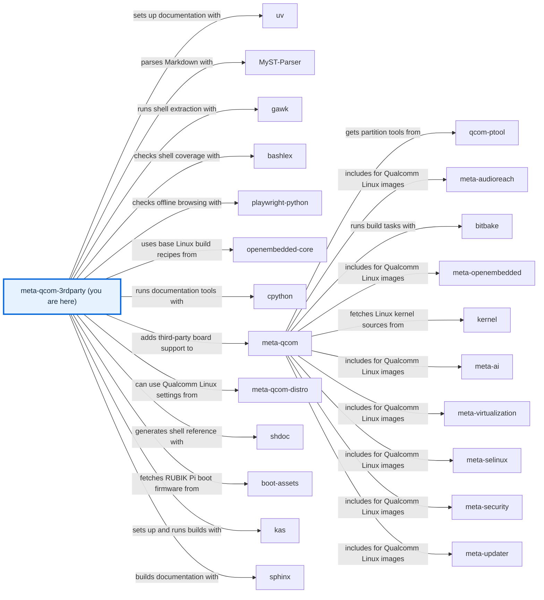

# meta-qcom-3rdparty

[)](https://github.com/qualcomm-linux/meta-qcom-3rdparty/actions/workflows/push.yml)
[)](https://github.com/qualcomm-linux/meta-qcom-3rdparty/actions/workflows/nightly-build.yml)

[)](https://github.com/qualcomm-linux/meta-qcom-3rdparty/actions/workflows/push.yml?query=branch%3Awrynose)
[)](https://github.com/qualcomm-linux/meta-qcom-3rdparty/actions/workflows/nightly-build.yml?query=branch%3Awrynose)

## Introduction

OpenEmbedded/Yocto Project BSP layer for Third-Party Maintained Qualcomm based
platforms.

This layer provides additional recipes and machine configuration files for
Third-Party Maintained Qualcomm platforms. Reference boards that are officially
supported by Qualcomm are available via [meta-qcom](https://github.com/qualcomm-linux/meta-qcom) instead.

This layer depends on:

```text
URI: https://github.com/openembedded/openembedded-core.git
layers: meta
branch: master
revision: HEAD

URI: https://github.com/qualcomm-linux/meta-qcom.git
branch: master
revision: HEAD
```

## First build and documentation

Start with the [development environment](docs/source/contributing/DEVELOPMENT.md).
From the checkout root, build RUBIK Pi 3 with `kas-container build ci/rubikpi3.yml`.
Follow the [image tutorial](docs/source/user/USAGE.md) to inspect the output.
Open [docs/site/index.html](docs/site/index.html) directly for offline guides,
configuration, and native function references.

## Branches

- **main:** Primary development branch, with focus on upstream support and
  compatibility with the most recent Yocto Project release.
- **wrynose:** LTS branch based on the Yocto Project 6.0 release, used by
  Qualcomm Linux 2.x.
- **scarthgap:** Qualcomm Linux >= 1.4, aligned with Yocto Project 5.0 (LTS).
- **kirkstone:** Qualcomm Linux <= 1.3, aligned with Yocto Project 4.0 (LTS).

See [branch maintenance](BRANCHES.md) for the upstream/fork relationship,
release contribution routes, and the complete fork branch inventory.
`next` is an upstream integration branch; use `main` for routine development.
`docs/contributor-reference` is this fork’s runnable documentation review branch.

### Fork topic branches

Each topic below is a fork integration or review branch, not a supported release.
Build it only to work on its named subject; ordinary contributions go upstream
as described in [branch maintenance](BRANCHES.md).

| Branches | Purpose and status |
| --- | --- |
| `devdocs/main`, `devdocs/build` | Fork integration and build work; review with the topic author before depending on it. |
| `devdocs/docs-v3`, `devdocs/generated-tutorials`, `devdocs/required-files-sphinx`, `devdocs/source-file-docs`, `devdocs/wrynose/docs`, `devdocs/wrynose/docs-v2` | Documentation topics; use only to review those proposals. |
| `docs/offline-layer-guides`, `docs/qli-2-tutorials`, `docs/repository-documentation`, `test/qualcomm-upgrade-astra`, `docs/contributor-reference` | Documentation review/test topics; this guide's runnable setup selects `docs/contributor-reference`. |
| `devdocs/imx219-cam2` | Camera integration topic; not the upstream board baseline. |
| `devdocs/s3-cache-backup` | Build-cache integration topic; not a release branch. |
| `devdocs/vscode` | Editor integration topic; not a release branch. |
| `radxa-dragon-q6a-hdmi`, `radxa-dragon-q6a-hdmi-cmdline-extra`, `radxa-dragon-q6a-hdmi-deferred-config`, `radxa-dragon-q6a-hdmi-uki-cmdline` | Radxa display bring-up topics; use only for that investigation. |
| `njjetha` | Personal topic with no declared release role; confirm its purpose with the author before use. |
| `upstream` | Separately maintained raw upstream baseline for fork review; do not send contributions here. |

## Machine Support

See [conf/machine](conf/machine/README.md) for the complete list of supported devices.

## Contributing

Please submit any patches against the `meta-qcom-3rdparty` layer by using
the GitHub pull-request feature. Fork the repo, create a branch,
do the work, rebase from upstream, and create the pull request.

For some useful guidelines when submitting patches, please refer to:
[Preparing Changes for Submission](https://docs.yoctoproject.org/dev/contributor-guide/submit-changes.html#preparing-changes-for-submission)

Pull requests will be discussed within the GitHub pull-request infrastructure.
See [CONTRIBUTING.md](CONTRIBUTING.md) for the contribution guide and required checks.

## Communication

- **GitHub Issues:** [meta-qcom-3rdparty issues](https://github.com/qualcomm-linux/meta-qcom-3rdparty/issues)
- **Pull Requests:** [meta-qcom-3rdparty pull requests](https://github.com/qualcomm-linux/meta-qcom-3rdparty/pulls)

## Maintainer(s)

- Ricardo Salveti <ricardo.salveti@oss.qualcomm.com>
- Nicolas Dechesne <nicolas.dechesne@oss.qualcomm.com>

Documentation reviews use the existing [CODEOWNERS](.github/CODEOWNERS).
Participants follow the [Code of Conduct](CODE_OF_CONDUCT.md); report
vulnerabilities privately through [SECURITY.md](SECURITY.md).

## License

This layer is licensed under the MIT license. Check out [LICENSE](LICENSE)
for more details. Imported documentation material has separate
[third-party notices](THIRD_PARTY_NOTICES.md).

## Folders

- [.github/](.github/) — Owns review templates, code ownership, validation tools, and CI workflows.
- [ci/](ci/README.md) — kas build compositions and CI helper scripts.
- [conf/](conf/README.md) — BitBake layer and machine configuration.
- [docs/](docs/README.md) — Documentation source and committed offline output.
- [dynamic-layers/](dynamic-layers/README.md) — Metadata enabled by optional layer collections.
- [recipes-bsp/](recipes-bsp/README.md) — Board firmware and packagegroup recipes.
- [recipes-kernel/](recipes-kernel/README.md) — Machine-specific kernel additions.

## Files

- [.env.example](.env.example) — Documents safe shell environment values without automatic loading.
- [.gitignore](.gitignore) — Excludes local environments, downloaded tools, and build intermediates.
- [AGENTS.md](AGENTS.md) — Directs automation to its authoritative instructions.
- [BRANCHES.md](BRANCHES.md) — Explains branch maintenance and contribution destinations.
- [CODE_OF_CONDUCT.md](CODE_OF_CONDUCT.md) — Defines participant conduct and private reporting.
- [CONTRIBUTING.md](CONTRIBUTING.md) — Directs contributors to the maintained contribution procedure.
- [COPYING.MIT](COPYING.MIT) — Retains the approved MIT licence text.
- [LICENSE](LICENSE) — Resolves to the approved MIT licence in COPYING.MIT.
- [README.md](README.md) — Describes this folder and indexes its contents.
- [SECURITY.md](SECURITY.md) — Provides private vulnerability reporting and support policy.
- [THIRD_PARTY_NOTICES.md](THIRD_PARTY_NOTICES.md) — Preserves full notices for reused documentation material.

<!-- repository-map:start -->

## Repository map



[Full Qualcomm repository map](https://github.com/devdocsorg/qualcomm-repository-map).

<!-- Generated from https://github.com/devdocsorg/qualcomm-repository-map at 292d855cabcc72bc52a0ac8a2504f3c1e89e1b84; dataset SHA-256: e9edd3db51efccb03c67457eb648e4b66097a83dda9cc341da4efa418e10a97d. -->

<!-- repository-map:end -->
