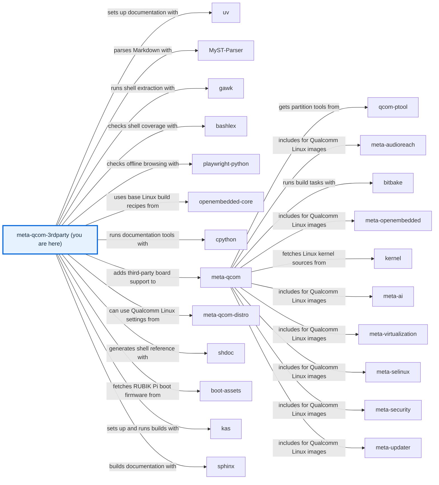
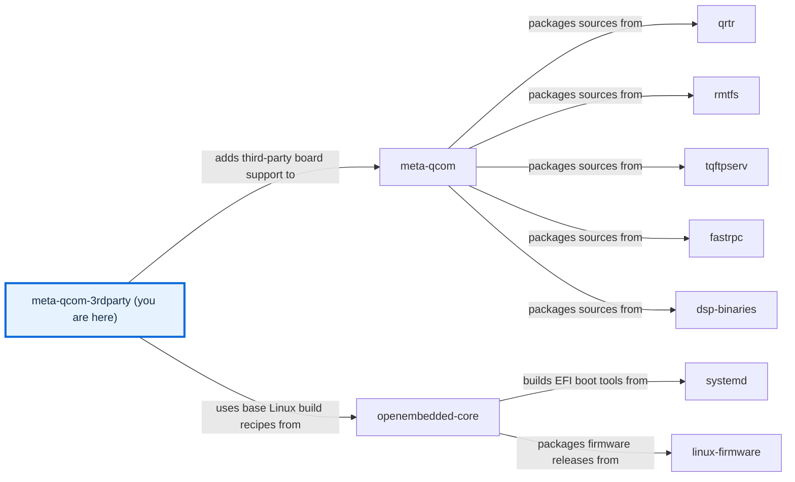

# meta-qcom-3rdparty

[)](https://github.com/qualcomm-linux/meta-qcom-3rdparty/actions/workflows/push.yml)
[)](https://github.com/qualcomm-linux/meta-qcom-3rdparty/actions/workflows/nightly-build.yml)

[)](https://github.com/qualcomm-linux/meta-qcom-3rdparty/actions/workflows/push.yml?query=branch%3Awrynose)
[)](https://github.com/qualcomm-linux/meta-qcom-3rdparty/actions/workflows/nightly-build.yml?query=branch%3Awrynose)

## Introduction

OpenEmbedded/Yocto Project BSP layer for Third-Party Maintained Qualcomm based
platforms.

This layer provides additional recipes and machine configuration files for
Third-Party Maintained Qualcomm platforms. Reference boards that are officially
supported by Qualcomm are available via `meta-qcom` instead.

This layer depends on:

```text
URI: https://github.com/openembedded/openembedded-core.git
layers: meta
branch: master
revision: HEAD

URI: https://github.com/qualcomm-linux/meta-qcom.git
branch: master
revision: HEAD
```

## First build and documentation

Follow the [development setup](docs/source/contributing/DEVELOPMENT.md), then run
`kas-container build ci/rubikpi3.yml` from the checkout root. The
[image tutorial](docs/source/user/USAGE.md) explains how to inspect the output.
Browse the [reference documentation](docs/site/index.html) directly from a local
checkout, or read its [source homepage](docs/source/README.md).

## Branches

- **main:** Primary development branch, with focus on upstream support and
  compatibility with the most recent Yocto Project release.
- **wrynose:** LTS branch based on the Yocto Project 6.0 release, used by
  Qualcomm Linux 2.x.
- **scarthgap:** Qualcomm Linux >= 1.4, aligned with Yocto Project 5.0 (LTS).
- **kirkstone:** Qualcomm Linux <= 1.3, aligned with Yocto Project 4.0 (LTS).

The upstream `next` branch integrates changes for testing before `main`; use it
for integration validation and send normal contributions to `main`.
The release branches above are maintained separately; choose matching layers when
building and send release fixes to the matching branch. The fork's `upstream`
branch retains its imported baseline, and `docs/offline-guides-and-layer-map` is
this documentation review branch. Long-lived maintenance relationships are in
[BRANCHES.md](BRANCHES.md); the canonical location after adoption is
[BRANCHES.md on main](https://github.com/qualcomm-linux/meta-qcom-3rdparty/blob/main/BRANCHES.md).

## Machine Support

See [conf/machine](conf/machine/README.md) for the complete list of supported devices.

## Contributing

Please submit any patches against the `meta-qcom-3rdparty` layer by using
the GitHub pull-request feature. Fork the repo, create a branch,
do the work, rebase from upstream, and create the pull request.

For some useful guidelines when submitting patches, please refer to:
[Preparing Changes for Submission](https://docs.yoctoproject.org/dev/contributor-guide/submit-changes.html#preparing-changes-for-submission)

Pull requests will be discussed within the GitHub pull-request infrastructure.

Read the [contribution procedure](CONTRIBUTING.md) for project scope and setup.

## Communication

- **GitHub Issues:** [meta-qcom-3rdparty issues](https://github.com/qualcomm-linux/meta-qcom-3rdparty/issues)
- **Pull Requests:** [meta-qcom-3rdparty pull requests](https://github.com/qualcomm-linux/meta-qcom-3rdparty/pulls)

## Maintainer(s)

- Ricardo Salveti <ricardo.salveti@oss.qualcomm.com>
- Nicolas Dechesne <nicolas.dechesne@oss.qualcomm.com>

## License

This layer is licensed under the MIT license. Check out [LICENSE](LICENSE)
for more details.

## Folders

- [.github](.github) — Owns workflows, issue and PR templates, review ownership, and documentation tooling.
- [ci](ci/README.md) — Contains kas compositions and CI helper scripts.
- [conf](conf/README.md) — Defines layer discovery and supported machines.
- [docs](docs/README.md) — Contains documentation sources and generated output.
- [dynamic-layers](dynamic-layers/README.md) — Activates extensions for optional distribution layers.
- [recipes-bsp](recipes-bsp/README.md) — Supplies board firmware and packagegroups.
- [recipes-kernel](recipes-kernel/README.md) — Extends the upstream kernel for supported boards.

## Files

- [.env.example](.env.example) — Documents safe optional build environment exports.
- [.gitignore](.gitignore) — Excludes secrets and local build environments.
- [AGENTS.md](AGENTS.md) — Directs automation to the maintained agent procedure.
- [BRANCHES.md](BRANCHES.md) — Explains branch purposes and maintenance relationships.
- [CODE_OF_CONDUCT.md](CODE_OF_CONDUCT.md) — Defines community conduct and private reporting.
- [CONTRIBUTING.md](CONTRIBUTING.md) — Links the contribution procedure and development setup.
- [COPYING.MIT](COPYING.MIT) — Contains the layer’s approved MIT licence text.
- [LICENSE](LICENSE) — Exposes the approved licence through the required discovery filename.
- [README.md](README.md) — Orients readers and indexes this folder.
- [SECURITY.md](SECURITY.md) — Explains private vulnerability reporting and supported branches.

<!-- repository-map:start -->

## Repository map

### Connections (1/2)



### Connections (2/2)



[Full Qualcomm repository map](https://github.com/devdocsorg/qualcomm-repository-map).

<!-- Generated from https://github.com/devdocsorg/qualcomm-repository-map at e7ba6a7430d9b584c9c978636903d24901c515a8; dataset SHA-256: d7dac00d05ca2eec298c967fbdbb07af974055e4da05e42a86f2ada8f859c513. -->

<!-- repository-map:end -->
