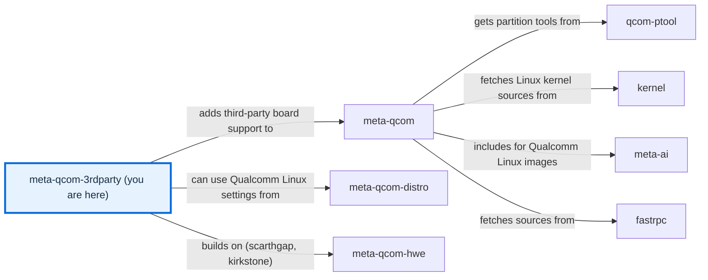

# meta-qcom-3rdparty

[)](https://github.com/qualcomm-linux/meta-qcom-3rdparty/actions/workflows/push.yml)
[)](https://github.com/qualcomm-linux/meta-qcom-3rdparty/actions/workflows/nightly-build.yml)

[)](https://github.com/qualcomm-linux/meta-qcom-3rdparty/actions/workflows/push.yml?query=branch%3Awrynose)
[)](https://github.com/qualcomm-linux/meta-qcom-3rdparty/actions/workflows/nightly-build.yml?query=branch%3Awrynose)

## Introduction

OpenEmbedded/Yocto Project BSP layer for Third-Party Maintained Qualcomm based
platforms.

This layer provides additional recipes and machine configuration files for
Third-Party Maintained Qualcomm platforms. Reference boards that are officially
supported by Qualcomm are available via [meta-qcom](https://github.com/qualcomm-linux/meta-qcom) instead.

This layer depends on:

```text
URI: https://github.com/openembedded/openembedded-core.git
layers: meta
branch: master
revision: HEAD

URI: https://github.com/qualcomm-linux/meta-qcom.git
branch: master
revision: HEAD
```

## Branches

| Branch | Purpose | Status | Build from it | Contributions |
| --- | --- | --- | --- | --- |
| `main` | Primary development branch, with focus on upstream support and compatibility with the most recent Yocto Project release. | Active | Yes | [Submit here](docs/source/contributing/CONTRIBUTING.md#27--branches-and-pull-requests) |
| `wrynose` | LTS branch based on the Yocto Project 6.0 release, used by Qualcomm Linux 2.x. | Maintained LTS | Yes, for Qualcomm Linux 2.x | [Backported from `main`](docs/source/contributing/CONTRIBUTING.md#27--branches-and-pull-requests) |
| `scarthgap` | Qualcomm Linux >= 1.4, aligned with Yocto Project 5.0 (LTS). | LTS, last changed September 2025 | No: layer and CI configuration only, no machines | [Qualcomm Linux 1.x board support](docs/source/contributing/CONTRIBUTING.md#27--branches-and-pull-requests) |
| `kirkstone` | Qualcomm Linux <= 1.3, aligned with Yocto Project 4.0 (LTS). | LTS, last changed April 2025 | No: layer and CI configuration only, no machines | [No documented target](docs/source/contributing/CONTRIBUTING.md#27--branches-and-pull-requests) |
| `next` | Staging branch that CI builds on push. | Inactive since August 2026; behind `main` | No: it still carries boards that moved to [meta-qcom-arduino](https://github.com/qualcomm-linux/meta-qcom-arduino) | [Not a target](docs/source/contributing/CONTRIBUTING.md#27--branches-and-pull-requests) |
| `backport/<PR>-to-<branch>` | Temporary branches opened by the backport workflow. | Temporary | No | [Reviewed in the backport pull request](docs/source/contributing/CONTRIBUTING.md#27--branches-and-pull-requests) |

This table lists every current branch.
[BRANCHES.md](BRANCHES.md) describes how the long-lived branches are maintained.

## Machine Support

See [conf/machine](conf/machine/README.md) for the complete list of supported devices.

## Documentation

Open [docs/site/index.html](docs/site/index.html) directly in a browser for the
generated documentation. The [documentation guide](docs/README.md) explains
where its source lives and how to rebuild it.

- [Build tutorial](docs/source/user/USAGE.md) — Build a first image for a board in this layer.
- [Configuration reference](docs/source/user/CONFIGURATION.md) — Understand the layer, machine, kas, recipe, and CI settings.
- [Development setup](docs/source/contributing/DEVELOPMENT.md) — Prepare a checkout, run the checks, and rebuild the documentation.
- [Function reference](docs/site/contributing/README.html) — Browse the generated reference for the shell functions and BitBake tasks.

## Contributing

Read [CONTRIBUTING.md](CONTRIBUTING.md) before submitting a change, and follow
the [Code of Conduct](CODE_OF_CONDUCT.md).

## Communication

- **GitHub Issues:** [meta-qcom-3rdparty issues](https://github.com/qualcomm-linux/meta-qcom-3rdparty/issues)
- **Pull Requests:** [meta-qcom-3rdparty pull requests](https://github.com/qualcomm-linux/meta-qcom-3rdparty/pulls)

## Maintainer(s)

- Ricardo Salveti <ricardo.salveti@oss.qualcomm.com>
- Nicolas Dechesne <nicolas.dechesne@oss.qualcomm.com>

## License

This layer is licensed under the MIT license. Check out [LICENSE](LICENSE)
for more details. [NOTICE](NOTICE) retains the licences of the adapted
documentation tooling and templates.

## Folders

- [ci/](ci/README.md) — Contains the kas build fragments and the CI helper scripts.
- [conf/](conf/README.md) — Contains the layer configuration and the machine definitions.
- [docs/](docs/README.md) — Contains the documentation source, the generated site, and its build entry point.
- [dynamic-layers/](dynamic-layers/README.md) — Contains metadata that applies only when an optional layer is present.
- [recipes-bsp/](recipes-bsp/README.md) — Contains the board firmware and packagegroup recipes.
- [recipes-kernel/](recipes-kernel/README.md) — Contains the kernel recipe append and its configuration fragment.
- [.github/](.github/) — Holds [CODEOWNERS](.github/CODEOWNERS), [issue templates](.github/ISSUE_TEMPLATE/), the [pull request template](.github/PULL_REQUEST_TEMPLATE/pr_template.md), [CI workflows](.github/workflows/), the [Markdown lint settings](.github/.markdownlint.yaml), and the documentation helpers [finalise_site.py](.github/finalise_site.py), [check_offline.py](.github/check_offline.py), and [test_reference_coverage.py](.github/test_reference_coverage.py).

## Files

- [README.md](README.md) — Introduces the layer, its branches, and its contents.
- [AGENTS.md](AGENTS.md) — Points automation agents to the agent guide.
- [BRANCHES.md](BRANCHES.md) — Describes how each long-lived branch is maintained.
- [CODE_OF_CONDUCT.md](CODE_OF_CONDUCT.md) — States participation standards and how to report conduct concerns.
- [CONTRIBUTING.md](CONTRIBUTING.md) — Points to the contribution guide and development setup.
- [LICENSE](LICENSE) — Contains the layer's MIT licence.
- [NOTICE](NOTICE) — Retains the licences of the adapted documentation tooling and templates.
- [SECURITY.md](SECURITY.md) — Explains how to report vulnerabilities privately.
- [.env.example](.env.example) — Documents the environment variables the build helpers read.
- [.gitignore](.gitignore) — Keeps local environment files, the documentation environment, and build caches out of version control.

<!-- repository-map:start -->

## Repository map



[Full Qualcomm repository map](https://github.com/devdocsorg/qualcomm-repository-map).

<!-- Generated from https://github.com/devdocsorg/qualcomm-repository-map at 6607f3ed96df695c7b6c393a4c7fde21e0a89e80; dataset SHA-256: e31bc2e3c37c6daebc112fc3f6c5c0b013d6f10727403fa360cb7b15678ee329. -->

<!-- repository-map:end -->
