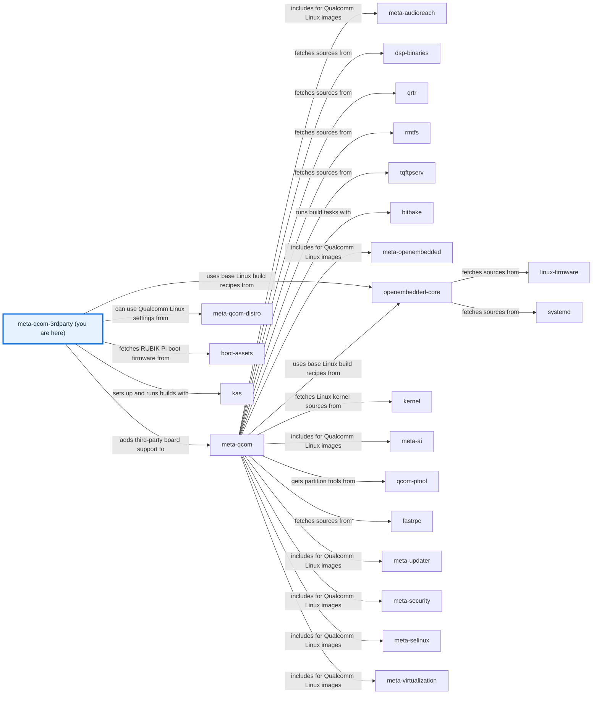

# meta-qcom-3rdparty

[)](https://github.com/qualcomm-linux/meta-qcom-3rdparty/actions/workflows/push.yml)
[)](https://github.com/qualcomm-linux/meta-qcom-3rdparty/actions/workflows/nightly-build.yml)

[)](https://github.com/qualcomm-linux/meta-qcom-3rdparty/actions/workflows/push.yml?query=branch%3Awrynose)
[)](https://github.com/qualcomm-linux/meta-qcom-3rdparty/actions/workflows/nightly-build.yml?query=branch%3Awrynose)

## Introduction

OpenEmbedded/Yocto Project BSP layer for Third-Party Maintained Qualcomm based
platforms.

This layer provides additional recipes and machine configuration files for
Third-Party Maintained Qualcomm platforms. Reference boards that are officially
supported by Qualcomm are available via `meta-qcom` instead.

To build an image for a supported board, follow the
[usage tutorial](docs/source/user/USAGE.md).

This layer depends on:

```text
URI: https://github.com/openembedded/openembedded-core.git
layers: meta
branch: master
revision: HEAD

URI: https://github.com/qualcomm-linux/meta-qcom.git
branch: master
revision: HEAD
```

## Branches

- **main:** Primary development branch, with focus on upstream support and
  compatibility with the most recent Yocto Project release.
- **wrynose:** LTS branch based on the Yocto Project 6.0 release, used by
  Qualcomm Linux 2.x.
- **scarthgap:** Qualcomm Linux >= 1.4, aligned with Yocto Project 5.0 (LTS).
- **kirkstone:** Qualcomm Linux <= 1.3, aligned with Yocto Project 4.0 (LTS).
- **next:** Staging branch for validating CI workflow changes; do not build
  from it or send contributions to it.

Build from `main` or from the branch matching your Qualcomm Linux release, and
send contributions to `main`. The backport workflow creates temporary
`backport/<number>-to-wrynose` branches for its pull requests.
[BRANCHES.md](BRANCHES.md) describes each branch's status and maintenance.

## Machine Support

See [conf/machine](conf/machine/README.md) for the complete list of supported devices.

## Documentation

Open [docs/site/index.html](docs/site/index.html) directly in a browser for the
generated documentation site; the [documentation guide](docs/README.md)
explains where its source lives and how to rebuild it.

- [Usage tutorial](docs/source/user/USAGE.md) — Build an image for a supported board and find the output.
- [Configuration reference](docs/source/user/CONFIGURATION.md) — Layer, machine, kas, environment, and workflow settings.
- [Development setup](docs/source/contributing/DEVELOPMENT.md) — Install the documentation tools and run the local checks.
- [Function reference](docs/source/contributing/README.md#function-reference) — Shell functions and BitBake tasks, generated from their comments.

## Contributing

Please submit any patches against the `meta-qcom-3rdparty` layer by using
the GitHub pull-request feature. Fork the repo, create a branch,
do the work, rebase from upstream, and create the pull request.

For some useful guidelines when submitting patches, please refer to:
[Preparing Changes for Submission](https://docs.yoctoproject.org/dev/contributor-guide/submit-changes.html#preparing-changes-for-submission)

Pull requests will be discussed within the GitHub pull-request infrastructure.

Read [CONTRIBUTING.md](CONTRIBUTING.md) for the contribution guide and
development setup, and follow the [Code of Conduct](CODE_OF_CONDUCT.md).
Report vulnerabilities privately as described in [SECURITY.md](SECURITY.md).

## Communication

- **GitHub Issues:** [meta-qcom-3rdparty issues](https://github.com/qualcomm-linux/meta-qcom-3rdparty/issues)
- **Pull Requests:** [meta-qcom-3rdparty pull requests](https://github.com/qualcomm-linux/meta-qcom-3rdparty/pulls)

## Maintainer(s)

- Ricardo Salveti <ricardo.salveti@oss.qualcomm.com>
- Nicolas Dechesne <nicolas.dechesne@oss.qualcomm.com>

## License

This layer is licensed under the MIT license. Check out [LICENSE](LICENSE)
for more details. [NOTICE](NOTICE) lists the licences of reused documentation
tooling and templates.

## Folders

- [.github/](.github/) — Holds [CODEOWNERS](.github/CODEOWNERS), issue and pull request templates, CI workflows, the markdownlint configuration, and the documentation check scripts.
- [ci/](ci/README.md) — Contains kas fragments and the helper scripts CI runs.
- [conf/](conf/README.md) — Contains the layer configuration and machine definitions.
- [docs/](docs/README.md) — Contains the documentation source and the generated site.
- [dynamic-layers/](dynamic-layers/README.md) — Contains additions that apply only when another layer is present.
- [recipes-bsp/](recipes-bsp/README.md) — Contains board firmware and packagegroup recipes.
- [recipes-kernel/](recipes-kernel/README.md) — Contains kernel appends and configuration fragments.

## Files

- [README.md](README.md) — Introduces the layer, its branches, documentation, and maintainers.
- [BRANCHES.md](BRANCHES.md) — Describes each long-lived branch and how it is maintained.
- [CONTRIBUTING.md](CONTRIBUTING.md) — Points to the contribution guide and development setup.
- [AGENTS.md](AGENTS.md) — Points automation agents to the agent guide.
- [CODE_OF_CONDUCT.md](CODE_OF_CONDUCT.md) — States participation standards and how to report conduct concerns.
- [SECURITY.md](SECURITY.md) — Explains how to report security issues and which branches receive fixes.
- [LICENSE](LICENSE) — Contains the layer's MIT licence.
- [NOTICE](NOTICE) — Contains the licence notices for reused documentation tooling and templates.
- [.env.example](.env.example) — Lists the environment settings for kas-container builds with safe example values.
- [.gitignore](.gitignore) — Keeps local environment files, the documentation environment, and build caches out of version control.

<!-- repository-map:start -->

## Repository map



[Full Qualcomm repository map](https://github.com/devdocsorg/qualcomm-repository-map).

<!-- Generated from https://github.com/devdocsorg/qualcomm-repository-map at 6516f060326ce5ac5708e4bd52b6eade17dd4652; dataset SHA-256: faeaa003512a56069acce7f99fbd2c42eb6d67bc29591a2f449a5e399f0b5028. -->

<!-- repository-map:end -->
