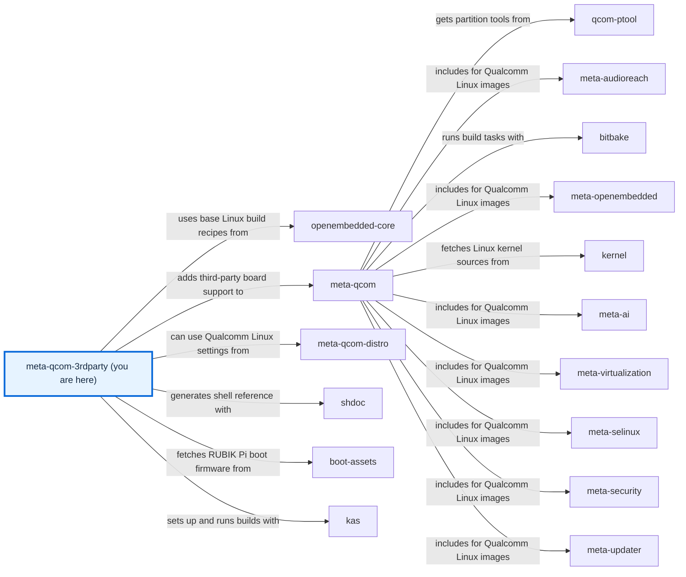

# meta-qcom-3rdparty

[)](https://github.com/qualcomm-linux/meta-qcom-3rdparty/actions/workflows/push.yml)
[)](https://github.com/qualcomm-linux/meta-qcom-3rdparty/actions/workflows/nightly-build.yml)

[)](https://github.com/qualcomm-linux/meta-qcom-3rdparty/actions/workflows/push.yml?query=branch%3Awrynose)
[)](https://github.com/qualcomm-linux/meta-qcom-3rdparty/actions/workflows/nightly-build.yml?query=branch%3Awrynose)

## Introduction

OpenEmbedded/Yocto Project BSP layer for Third-Party Maintained Qualcomm based
platforms.

This layer provides additional recipes and machine configuration files for
Third-Party Maintained Qualcomm platforms. Reference boards that are officially
supported by Qualcomm are available via `meta-qcom` instead.

This layer depends on:

```text
URI: https://github.com/openembedded/openembedded-core.git
layers: meta
branch: master
revision: HEAD

URI: https://github.com/qualcomm-linux/meta-qcom.git
branch: master
revision: HEAD
```

## Getting Started

Follow the [usage tutorial](docs/source/contributing/USAGE.md) to prepare the workspace. Then inspect
the selected [build configuration](ci/radxa-dragon-q6a.yml):

```sh
kas-container dump ci/radxa-dragon-q6a.yml
```

The [documentation guide](docs/README.md) links the tutorial,
[configuration reference](docs/source/user/CONFIGURATION.md), and the Sphinx build
for the [generated function reference](docs/source/contributing/README.md#function-reference).

Open [docs/site/index.html](docs/site/index.html) directly in a browser for the locally browsable site.
See the [nearby repository map](#repository-map) for this layer's
place in the Qualcomm ecosystem, and [development environment setup](docs/source/contributing/DEVELOPMENT.md)
to prepare a contributor checkout and the documentation toolchain.

## Branches

- **main:** Primary development branch, with focus on upstream support and
  compatibility with the most recent Yocto Project release.
- **wrynose:** LTS branch based on the Yocto Project 6.0 release, used by
  Qualcomm Linux 2.x.
- **scarthgap:** Qualcomm Linux >= 1.4, aligned with Yocto Project 5.0 (LTS).
- **kirkstone:** Qualcomm Linux <= 1.3, aligned with Yocto Project 4.0 (LTS).

- **next:** CI and workflow validation before changes land on `main`;
  use for testing and send new contributions through the `main` review process.

See [BRANCHES.md](BRANCHES.md) for branch relationships.

The `devdocsorg` fork hosts integration and review work; product contributions
still go to `qualcomm-linux/meta-qcom-3rdparty`. Its `main`, `next`, `scarthgap`,
and `kirkstone` branches are fork copies, and `upstream` records the upstream
baseline used for review. Select release builds from the upstream branches above.

The fork's remaining branches are topic or integration work, rather than release
branches. Build them only to test the named change and send product fixes through
the upstream contribution process:

- **devdocs/main:** Fork integration work, maintained separately from upstream releases.
- **devdocs/build** and **devdocs/s3-cache-backup:** Build resource settings and cache integration work for `devdocs/main`.
- **devdocs/docs-v3**, **devdocs/wrynose/docs**, and **devdocs/wrynose/docs-v2:** Documentation work for the corresponding development or `wrynose` baseline.
- **devdocs/generated-tutorials** and **docs/qli-2-tutorials:** Generated tutorial proposals.
- **devdocs/source-file-docs:** Source-comment documentation work.
- **devdocs/required-files-sphinx** and **docs/repository-documentation:** Documentation proposals available for review, not release branches.
- **test/qualcomm-upgrade-astra:** Retained documentation topic work; not a release branch.
- **devdocs/imx219-cam2:** Dragon Q6A IMX219 CAM2 integration work.
- **devdocs/vscode:** Development runtime support work.
- **njjetha:** Preflight-check integration work.
- **radxa-dragon-q6a-hdmi**, **radxa-dragon-q6a-hdmi-cmdline-extra**, **radxa-dragon-q6a-hdmi-deferred-config**, and **radxa-dragon-q6a-hdmi-uki-cmdline:** HDMI and deferred-probe alternatives for testing.

`BRANCHES.md` is part of this proposal and becomes the canonical branch guide on
`main` when adopted.

## Machine Support

See [conf/machine](conf/machine/README.md) for the complete list of supported devices.

## Contributing

Read [CONTRIBUTING.md](CONTRIBUTING.md) for the contribution guidelines.

Please submit any patches against the `meta-qcom-3rdparty` layer by using
the GitHub pull-request feature. Fork the repo, create a branch,
do the work, rebase from upstream, and create the pull request.

For some useful guidelines when submitting patches, please refer to:
[Preparing Changes for Submission](https://docs.yoctoproject.org/dev/contributor-guide/submit-changes.html#preparing-changes-for-submission)

Pull requests will be discussed within the GitHub pull-request infrastructure.

## Communication

- **GitHub Issues:** [meta-qcom-3rdparty issues](https://github.com/qualcomm-linux/meta-qcom-3rdparty/issues)
- **Pull Requests:** [meta-qcom-3rdparty pull requests](https://github.com/qualcomm-linux/meta-qcom-3rdparty/pulls)

Follow the [Code of Conduct](CODE_OF_CONDUCT.md) when participating, and use the
[security policy](SECURITY.md) to report vulnerabilities.

## Maintainer(s)

- Ricardo Salveti <ricardo.salveti@oss.qualcomm.com>
- Nicolas Dechesne <nicolas.dechesne@oss.qualcomm.com>

See [CODEOWNERS](.github/CODEOWNERS) for review ownership by repository path.

## License

This layer is licensed under the MIT license. Check out [LICENSE](LICENSE)
for more details.

## Folders

- [.github/](.github/): GitHub configuration, ownership, and contribution templates.
- [ci/](ci/README.md): Container helper scripts and kas configuration fragments.
- [conf/](conf/README.md): Layer registration and machine configuration.
- [docs/](docs/README.md): Documentation sources and the generated Sphinx website.
- [dynamic-layers/](dynamic-layers/README.md): Appends enabled only by matching optional layer collections.
- [recipes-bsp/](recipes-bsp/README.md): Board boot firmware and package groups.
- [recipes-kernel/](recipes-kernel/README.md): Kernel appends and configuration fragments.
- [skills/](skills/README.md): Points to skill documentation in the contributor guides.

## Files

- [.env.example](.env.example): Documents optional host paths with safe shell defaults.
- [.gitignore](.gitignore): Excludes local settings and generated documentation files.
- [AGENTS.md](AGENTS.md): Points to the agent instructions in the contributor documentation.
- [BRANCHES.md](BRANCHES.md): Documents branch purpose, maintenance, and integration relationships.
- [CODE_OF_CONDUCT.md](CODE_OF_CONDUCT.md): Defines participation standards and reporting.
- [CONTRIBUTING.md](CONTRIBUTING.md): Links the existing contribution guide and named PR template.
- [LICENSE](LICENSE): Contains the MIT licence and original copyright notice.
- [README.md](README.md): Introduces this directory and lists its contents.
- [SECURITY.md](SECURITY.md): Routes private vulnerability reports to the appropriate maintainers.

<!-- repository-map:start -->

## Repository map



[Full Qualcomm repository map](https://github.com/devdocsorg/qualcomm-repository-map).

<!-- Generated from https://github.com/devdocsorg/qualcomm-repository-map at 553011d6733c5dd580d4904635d39b3108bbcbb4; dataset SHA-256: e982748f04280948551ebc34df82a5ace5a3a15b61c228a4f6d3c796557bdcdd. -->

<!-- repository-map:end -->
