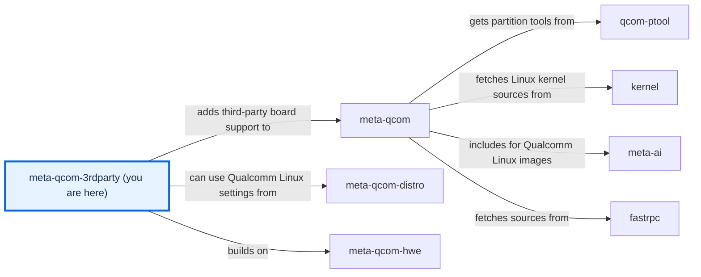

# meta-qcom-3rdparty

[)](https://github.com/qualcomm-linux/meta-qcom-3rdparty/actions/workflows/push.yml)
[)](https://github.com/qualcomm-linux/meta-qcom-3rdparty/actions/workflows/nightly-build.yml)

[)](https://github.com/qualcomm-linux/meta-qcom-3rdparty/actions/workflows/push.yml?query=branch%3Awrynose)
[)](https://github.com/qualcomm-linux/meta-qcom-3rdparty/actions/workflows/nightly-build.yml?query=branch%3Awrynose)

## Introduction

OpenEmbedded/Yocto Project BSP layer for Third-Party Maintained Qualcomm based
platforms.

This layer provides additional recipes and machine configuration files for
Third-Party Maintained Qualcomm platforms. Reference boards that are officially
supported by Qualcomm are available via `meta-qcom` instead.

To build and flash an image, follow the
[usage tutorial](docs/source/user/USAGE.md).

This layer depends on:

```text
URI: https://github.com/openembedded/openembedded-core.git
layers: meta
branch: master
revision: HEAD

URI: https://github.com/qualcomm-linux/meta-qcom.git
branch: master
revision: HEAD
```

## Branches

| Branch | Purpose | Status | Build from it | Send changes to |
| --- | --- | --- | --- | --- |
| **main** | Primary development branch, with focus on upstream support and compatibility with the most recent Yocto Project release. | Active | Yes | `main` |
| **wrynose** | LTS branch based on the Yocto Project 6.0 release, used by Qualcomm Linux 2.x. | Maintained | Yes, for Qualcomm Linux 2.x | `main`, then backported |
| **scarthgap** | Qualcomm Linux >= 1.4, aligned with Yocto Project 5.0 (LTS). | Maintenance | No: it holds only the layer configuration and CI, with no machines | `scarthgap` |
| **kirkstone** | Qualcomm Linux <= 1.3, aligned with Yocto Project 4.0 (LTS). | End of life, like Yocto Project 4.0 | No: it holds only the layer configuration and CI, with no machines | None |
| **next** | Maintainer branch for trying CI workflow changes before `main`. | Behind `main` | No: its `uno-q` and `ventuno-q` machines moved to meta-qcom-arduino | `main` |

This table lists every branch. The
[contribution guide](docs/source/contributing/CONTRIBUTING.md#27--target-branches-and-submission)
explains each route, and [BRANCHES.md](BRANCHES.md) describes how the branches
are maintained.

## Machine Support

See [conf/machine](conf/machine/README.md) for the complete list of supported devices.

## Documentation

Open [docs/site/index.html](docs/site/index.html) in a browser to read the
generated documentation offline, without a server. The
[documentation guide](docs/README.md) explains how to rebuild it.

- [Usage tutorial](docs/source/user/USAGE.md) — Build and flash an image for a supported board.
- [Configuration reference](docs/source/user/CONFIGURATION.md) — Layer, machine, kas, and CI settings.
- [Agent guide](docs/source/contributing/AGENTS.md) — kas-container builds and the checks to run before a pull request.
- [Development setup](docs/source/contributing/DEVELOPMENT.md) — Documentation tools and checks.
- [Function reference](docs/source/contributing/README.md#function-reference) — Generated from the comments in scripts and recipes.

## Contributing

Read [CONTRIBUTING.md](CONTRIBUTING.md) before submitting patches, and follow the
[Code of Conduct](CODE_OF_CONDUCT.md).

## Communication

- **GitHub Issues:** [meta-qcom-3rdparty issues](https://github.com/qualcomm-linux/meta-qcom-3rdparty/issues)
- **Pull Requests:** [meta-qcom-3rdparty pull requests](https://github.com/qualcomm-linux/meta-qcom-3rdparty/pulls)

## Maintainer(s)

- Ricardo Salveti <ricardo.salveti@oss.qualcomm.com>
- Nicolas Dechesne <nicolas.dechesne@oss.qualcomm.com>

## License

This layer is licensed under the MIT license. Check out [LICENSE](LICENSE)
for more details. [NOTICE](NOTICE) holds the licences of the adapted
documentation tooling and templates.

## Folders

- [.github/](.github/) — Holds the CI [workflows](.github/workflows/), [CODEOWNERS](.github/CODEOWNERS), [issue templates](.github/ISSUE_TEMPLATE/), the [pull request template](.github/PULL_REQUEST_TEMPLATE/pr_template.md), the markdownlint settings, and the documentation scripts.
- [ci/](ci/README.md) — Holds the kas fragments and the scripts CI runs.
- [conf/](conf/README.md) — Holds the layer configuration and machine definitions.
- [docs/](docs/README.md) — Holds the documentation source and the generated site.
- [dynamic-layers/](dynamic-layers/README.md) — Holds appends that apply only when other layers are present.
- [recipes-bsp/](recipes-bsp/README.md) — Holds board firmware recipes and packagegroups.
- [recipes-kernel/](recipes-kernel/README.md) — Holds kernel appends and configuration fragments.

## Files

- [README.md](README.md) — Introduces the layer, its branches, and its contents.
- [AGENTS.md](AGENTS.md) — Points automation agents to the agent guide.
- [BRANCHES.md](BRANCHES.md) — Describes how each branch is maintained.
- [CODE_OF_CONDUCT.md](CODE_OF_CONDUCT.md) — States the Contributor Covenant and how to report conduct concerns.
- [CONTRIBUTING.md](CONTRIBUTING.md) — Points to the contribution guide.
- [LICENSE](LICENSE) — Contains the layer's MIT licence.
- [NOTICE](NOTICE) — Contains the licences of adapted documentation tooling and templates.
- [SECURITY.md](SECURITY.md) — Explains how to report vulnerabilities privately.
- [.env.example](.env.example) — Documents the optional environment variables for kas-container builds.
- [.gitignore](.gitignore) — Keeps local settings and documentation build output out of commits.

<!-- repository-map:start -->

## Repository map



[Full Qualcomm repository map](https://github.com/devdocsorg/qualcomm-repository-map).

<!-- Generated from https://github.com/devdocsorg/qualcomm-repository-map at 440e7cbe0a6784fdc7653a4b866e2a971fc50c7d; dataset SHA-256: ceb8a26f713b66254d1739b35ad5d7cfdd436cbde221543448cf746a26bb1a4e. -->

<!-- repository-map:end -->
