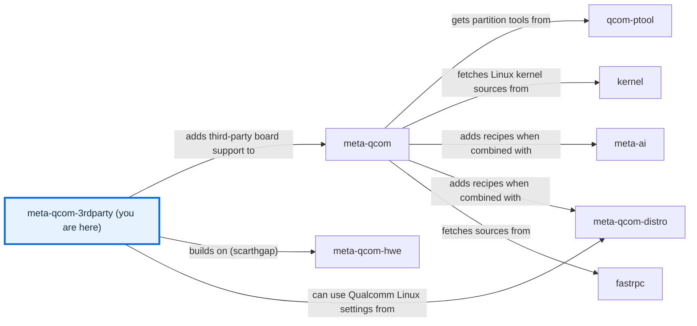

# meta-qcom-3rdparty

[)](https://github.com/qualcomm-linux/meta-qcom-3rdparty/actions/workflows/push.yml)
[)](https://github.com/qualcomm-linux/meta-qcom-3rdparty/actions/workflows/nightly-build.yml)

[)](https://github.com/qualcomm-linux/meta-qcom-3rdparty/actions/workflows/push.yml?query=branch%3Awrynose)
[)](https://github.com/qualcomm-linux/meta-qcom-3rdparty/actions/workflows/nightly-build.yml?query=branch%3Awrynose)

## Introduction

OpenEmbedded/Yocto Project BSP layer for Third-Party Maintained Qualcomm based
platforms.

This layer provides additional recipes and machine configuration files for
Third-Party Maintained Qualcomm platforms. Reference boards that are officially
supported by Qualcomm are available via [`meta-qcom`](https://github.com/qualcomm-linux/meta-qcom) instead.

This layer depends on:

```text
URI: https://github.com/openembedded/openembedded-core.git
layers: meta
branch: master
revision: HEAD

URI: https://github.com/qualcomm-linux/meta-qcom.git
branch: master
revision: HEAD
```

To build an image for a supported board, run
`kas-container build ci/rubikpi3.yml` from a checkout with
[kas-container](https://github.com/siemens/kas); the
[build tutorial](docs/source/user/USAGE.md) gives the prerequisites and the
expected output.

## Branches

| Branch | Purpose | Status | Build from it | Contributions | Relationship to `main` |
| --- | --- | --- | --- | --- | --- |
| [`main`](https://github.com/qualcomm-linux/meta-qcom-3rdparty/tree/main) | Primary development branch, with focus on upstream support and compatibility with the most recent Yocto Project release | In development; declares Yocto Project 6.1 (blacksail) compatibility; last commit 30 September 2026 | Yes: `rubikpi3` and `radxa-dragon-q6a` | All changes land here first ([upstream baseline](docs/source/contributing/CONTRIBUTING.md#3--upstream-baseline)) | — |
| [`wrynose`](https://github.com/qualcomm-linux/meta-qcom-3rdparty/tree/wrynose) | LTS branch based on the Yocto Project 6.0 release, used by Qualcomm Linux 2.x | LTS; Yocto Project 6.0 is supported until April 2030; last commit 24 September 2026 | Yes, for Qualcomm Linux 2.x: `rubikpi3` and `radxa-dragon-q6a` | Backports from `main`; changes that apply only here target it directly ([backporting](docs/source/contributing/CONTRIBUTING.md#29--backporting-to-a-release-branch)) | Maintained separately; receives backports from `main`, as its [BACKPORTING.md](https://github.com/qualcomm-linux/meta-qcom-3rdparty/blob/wrynose/BACKPORTING.md) states |
| [`next`](https://github.com/qualcomm-linux/meta-qcom-3rdparty/tree/next) | Not documented | Not documented; declares Yocto Project 6.0 (wrynose) compatibility; last commit 20 August 2026 | Not documented; its tree holds `radxa-dragon-q6a`, `uno-q`, and `ventuno-q`, the last two of which `main` moved to [`meta-qcom-arduino`](https://github.com/qualcomm-linux/meta-qcom-arduino) | Not documented | Not documented |
| [`scarthgap`](https://github.com/qualcomm-linux/meta-qcom-3rdparty/tree/scarthgap) | Qualcomm Linux >= 1.4, aligned with Yocto Project 5.0 (LTS) | Not documented; Yocto Project 5.0 is supported until April 2028; last commit 3 September 2025 | No: it holds layer and CI configuration but no machines | Qualcomm Linux 1.x board support ([downstream baseline](docs/source/contributing/CONTRIBUTING.md#4--downstream-baseline--qualcomm-linux-1x)) | Not documented |
| [`kirkstone`](https://github.com/qualcomm-linux/meta-qcom-3rdparty/tree/kirkstone) | Qualcomm Linux <= 1.3, aligned with Yocto Project 4.0 (LTS) | Not documented; Yocto Project 4.0 is end of life; last commit 9 April 2025 | No: it holds layer configuration but no machines | Not documented | Not documented |

Support periods come from the
[Yocto Project releases page](https://wiki.yoctoproject.org/wiki/Releases).
[SECURITY.md](SECURITY.md) states which branches accept security fixes.

## Machine Support

See [`conf/machine`](conf/machine/README.md) for the complete list of supported devices.

## Documentation

Build the site locally with `make -f docs/source/Makefile setup html` from the
repository root, then open `docs/site/index.html` directly in a browser. The
[documentation guide](docs/README.md) links the prerequisites.

- [Build tutorial](docs/source/user/USAGE.md) — Build an image for a supported board and find the flashable package.
- [Configuration reference](docs/source/user/CONFIGURATION.md) — The layer, machine, kas, kernel, and CI settings.
- [Development setup](docs/source/contributing/DEVELOPMENT.md) — Build the documentation and run the layer checks.
- [Function reference](docs/source/contributing/README.md#function-reference) — Generated into the site from the documentation comments in the scripts and recipes.

## Contributing

Please read [docs/source/contributing/CONTRIBUTING.md](docs/source/contributing/CONTRIBUTING.md) for the contribution
workflow, the layer scope rules and the commit subject and message
requirements before opening a pull request. Automation agents follow
[AGENTS.md](AGENTS.md).

## Communication

- **GitHub Issues:** [meta-qcom-3rdparty issues](https://github.com/qualcomm-linux/meta-qcom-3rdparty/issues)
- **Pull Requests:** [meta-qcom-3rdparty pull requests](https://github.com/qualcomm-linux/meta-qcom-3rdparty/pulls)

## Maintainer(s)

- Ricardo Salveti <ricardo.salveti@oss.qualcomm.com>
- Nicolas Dechesne <nicolas.dechesne@oss.qualcomm.com>

## License

This layer is licensed under the MIT license. Check out [LICENSE](LICENSE)
for more details. [NOTICE](NOTICE) lists the files that carry other licences.

## Folders

- [.github/](.github/) — Holds the [CI workflows](.github/workflows/), [CODEOWNERS](.github/CODEOWNERS), the [issue templates](.github/ISSUE_TEMPLATE/), the [pull request template](.github/PULL_REQUEST_TEMPLATE/pr_template.md), the [Markdown lint settings](.github/.markdownlint.yaml), and the documentation build scripts.
- [ci/](ci/README.md) — Holds the kas build fragments and the layer check scripts.
- [conf/](conf/README.md) — Holds the layer configuration and the machine configurations.
- [docs/](docs/README.md) — Holds the documentation source and explains how to build the site.
- [dynamic-layers/](dynamic-layers/README.md) — Holds appends that apply only when another layer is in the build.
- [recipes-bsp/](recipes-bsp/README.md) — Holds the board firmware recipe and the machine packagegroups.
- [recipes-kernel/](recipes-kernel/README.md) — Holds the kernel append and its configuration fragment.

## Files

- [README.md](README.md) — Introduces the layer, its branches, and its contents.
- [AGENTS.md](AGENTS.md) — Points automation agents to the agent guide.
- [CLAUDE.md](CLAUDE.md) — Links to `AGENTS.md` for agents that read this file name.
- [CONTRIBUTING.md](CONTRIBUTING.md) — Points to the contribution guide and development setup.
- [CODE_OF_CONDUCT.md](CODE_OF_CONDUCT.md) — States the expected behaviour and how to report conduct concerns.
- [SECURITY.md](SECURITY.md) — Explains how to report vulnerabilities and which branches accept security fixes.
- [LICENSE](LICENSE) — Contains the MIT licence.
- [NOTICE](NOTICE) — Lists the files under other licences, with their notices.
- [.env.example](.env.example) — Documents the optional environment settings for local builds.
- [.gitignore](.gitignore) — Keeps local environment files, documentation tools, and the generated site out of Git.

<!-- repository-map:start -->

## Repository map


```mermaid
flowchart LR
    r0["meta-qcom-3rdparty (you are here)"]
    click r0 href "https://github.com/qualcomm-linux/meta-qcom-3rdparty" _blank
    r1["kernel"]
    click r1 href "https://github.com/qualcomm-linux/kernel" _blank
    r2["meta-ai"]
    click r2 href "https://github.com/qualcomm-linux/meta-ai" _blank
    r3["meta-qcom"]
    click r3 href "https://github.com/qualcomm-linux/meta-qcom" _blank
    r4["meta-qcom-distro"]
    click r4 href "https://github.com/qualcomm-linux/meta-qcom-distro" _blank
    r5["meta-qcom-hwe"]
    click r5 href "https://github.com/qualcomm-linux/meta-qcom-hwe" _blank
    r6["qcom-ptool"]
    click r6 href "https://github.com/qualcomm-linux/qcom-ptool" _blank
    r7["fastrpc"]
    click r7 href "https://github.com/qualcomm/fastrpc" _blank
    r0 -->|"adds third-party board support to"| r3
    r0 -->|"builds on (scarthgap)"| r5
    r0 -->|"can use Qualcomm Linux settings from"| r4
    r3 -->|"gets partition tools from"| r6
    r3 -->|"fetches Linux kernel sources from"| r1
    r3 -->|"adds recipes when combined with"| r2
    r3 -->|"adds recipes when combined with"| r4
    r3 -->|"fetches sources from"| r7
    style r0 fill:#e6f3ff,stroke:#0969da,stroke-width:3px,color:#182c43
```

[Full Qualcomm repository map](https://github.com/devdocsorg/qualcomm-repository-map).

<!-- Generated from https://github.com/devdocsorg/qualcomm-repository-map at 2d4a2fb5ee1e6d6e75f85c3ba1352b80a173b7eb; dataset SHA-256: 8e92870c8f246f499f7a96cd90969886d317f45fb8a76c553db35e306a044275. -->

<!-- repository-map:end -->
