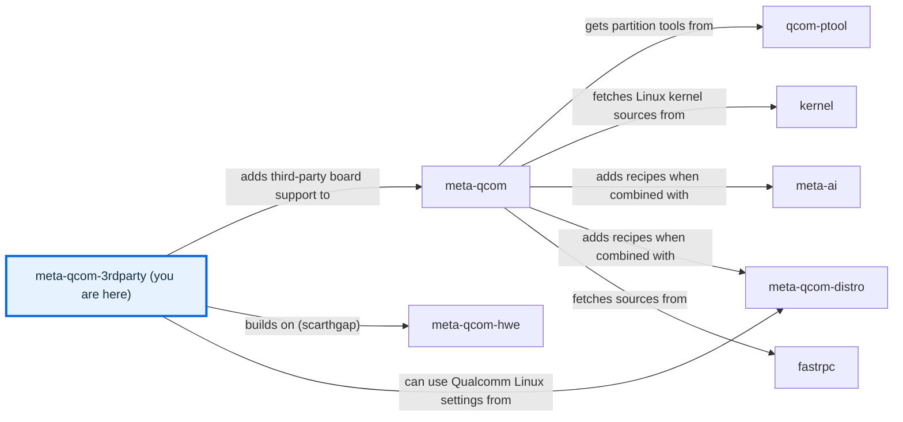

# meta-qcom-3rdparty

[)](https://github.com/qualcomm-linux/meta-qcom-3rdparty/actions/workflows/push.yml)
[)](https://github.com/qualcomm-linux/meta-qcom-3rdparty/actions/workflows/nightly-build.yml)

[)](https://github.com/qualcomm-linux/meta-qcom-3rdparty/actions/workflows/push.yml?query=branch%3Awrynose)
[)](https://github.com/qualcomm-linux/meta-qcom-3rdparty/actions/workflows/nightly-build.yml?query=branch%3Awrynose)

## Introduction

OpenEmbedded/Yocto Project BSP layer for Third-Party Maintained Qualcomm based
platforms.

This layer provides additional recipes and machine configuration files for
Third-Party Maintained Qualcomm platforms. Reference boards that are officially
supported by Qualcomm are available via `meta-qcom` instead.

This layer depends on:

```text
URI: https://github.com/openembedded/openembedded-core.git
layers: meta
branch: master
revision: HEAD

URI: https://github.com/qualcomm-linux/meta-qcom.git
branch: master
revision: HEAD
```

## Branches

- **main:** Primary development branch, with focus on upstream support and
  compatibility with the most recent Yocto Project release.
- **wrynose:** LTS branch based on the Yocto Project 6.0 release, used by
  Qualcomm Linux 2.x.
- **scarthgap:** Qualcomm Linux >= 1.4, aligned with Yocto Project 5.0 (LTS).
- **kirkstone:** Qualcomm Linux <= 1.3, aligned with Yocto Project 4.0 (LTS).

| Branch | Status | Build from it | Contributions |
| --- | --- | --- | --- |
| `main` | Active; builds on every push and nightly | Yes: `rubikpi3` and `radxa-dragon-q6a` | [Upstream baseline](docs/source/contributing/CONTRIBUTING.md#3--upstream-baseline) |
| `wrynose` | Active; builds on every push and nightly; Yocto Project 6.0 is supported until April 2030 | Yes: the same machines as `main` | [Backports from `main`](docs/source/contributing/CONTRIBUTING.md#21--pull-request-workflow) |
| `scarthgap` | Yocto Project 5.0 is supported until April 2028; last change 2025-09-03 | No: it holds only the layer and CI configuration, without machines or recipes | [Downstream baseline](docs/source/contributing/CONTRIBUTING.md#4--downstream-baseline--qualcomm-linux-1x) |
| `kirkstone` | Yocto Project 4.0 is end of life; last change 2025-04-09 | No: it holds only the layer and CI configuration, without machines or recipes | Not documented |
| `next` | Validates workflow changes before they land on `main`, per [9d6a08d](https://github.com/qualcomm-linux/meta-qcom-3rdparty/commit/9d6a08df6bf47047d359794155f315fae5c6b96d); status not documented; last change 2026-08-20; builds on push | Its tree holds `uno-q`, `ventuno-q`, and `radxa-dragon-q6a` machines; whether to build from it is not documented | Not documented |

This table lists every current branch. Support periods come from the
[Yocto Project releases page](https://wiki.yoctoproject.org/wiki/Releases).
[BRANCHES.md](BRANCHES.md) describes how the branches are maintained.

## Machine Support

See [conf/machine](conf/machine/README.md) for the complete list of supported devices.

## Documentation

Build the documentation site from the repository root, after installing its
[prerequisites](docs/source/contributing/DEVELOPMENT.md#prerequisites), then open
`docs/site/index.html` directly in a browser:

```sh
make -f docs/source/Makefile setup html
```

- [Build an image](docs/source/user/USAGE.md) — Build and find a `rubikpi3` image with kas-container.
- [Configuration reference](docs/source/user/CONFIGURATION.md) — Understand each setting in the layer, machine, recipe, and kas files.
- [Development setup](docs/source/contributing/DEVELOPMENT.md) — Prepare a checkout, run the layer checks, and build the documentation.

## Contributing

Please read [CONTRIBUTING.md](CONTRIBUTING.md) for the contribution
workflow, the layer scope rules and the commit subject and message
requirements before opening a pull request. Follow the
[Code of Conduct](CODE_OF_CONDUCT.md), and report vulnerabilities through
[SECURITY.md](SECURITY.md).

## Communication

- **GitHub Issues:** [meta-qcom-3rdparty issues](https://github.com/qualcomm-linux/meta-qcom-3rdparty/issues)
- **Pull Requests:** [meta-qcom-3rdparty pull requests](https://github.com/qualcomm-linux/meta-qcom-3rdparty/pulls)

## Maintainer(s)

- Ricardo Salveti <ricardo.salveti@oss.qualcomm.com>
- Nicolas Dechesne <nicolas.dechesne@oss.qualcomm.com>

## License

This layer is licensed under the MIT license. Check out [LICENSE](LICENSE)
for more details.

## Folders

- [.github/](.github/) — Holds [CODEOWNERS](.github/CODEOWNERS), the [workflows](.github/workflows/), the [issue templates](.github/ISSUE_TEMPLATE/), the [pull request template](.github/PULL_REQUEST_TEMPLATE/pr_template.md), the Markdown lint settings, the documentation build helpers, and the [notices](.github/THIRD_PARTY_NOTICES.txt) for those helpers and templates.
- [ci/](ci/README.md) — Contains the kas build fragments and the scripts that run the layer checks.
- [conf/](conf/README.md) — Contains the layer configuration and the machine definitions.
- [docs/](docs/README.md) — Contains the documentation source and explains how to build the site.
- [dynamic-layers/](dynamic-layers/README.md) — Contains appends that apply only when another layer is in the build.
- [recipes-bsp/](recipes-bsp/README.md) — Contains the board firmware and packagegroup recipes.
- [recipes-kernel/](recipes-kernel/README.md) — Contains the kernel append and its configuration fragments.

## Files

- [README.md](README.md) — Introduces the layer, its branches, and its contents.
- [AGENTS.md](AGENTS.md) — Points automation agents to the agent guide.
- [CLAUDE.md](CLAUDE.md) — Links to `AGENTS.md` for agents that read this name.
- [BRANCHES.md](BRANCHES.md) — Describes how each long-lived branch is maintained.
- [CONTRIBUTING.md](CONTRIBUTING.md) — Points to the contribution guide.
- [CODE_OF_CONDUCT.md](CODE_OF_CONDUCT.md) — States participation standards and how to report conduct concerns.
- [SECURITY.md](SECURITY.md) — Explains how to report vulnerabilities and which branches receive security fixes.
- [LICENSE](LICENSE) — Contains the layer's MIT licence.
- [.env.example](.env.example) — Documents the environment settings that the build and check commands read.
- [.gitignore](.gitignore) — Keeps local environment files, the documentation tools, and the generated site out of Git.

<!-- repository-map:start -->

## Repository map


```mermaid
flowchart LR
    r0["meta-qcom-3rdparty (you are here)"]
    click r0 href "https://github.com/qualcomm-linux/meta-qcom-3rdparty" _blank
    r1["kernel"]
    click r1 href "https://github.com/qualcomm-linux/kernel" _blank
    r2["meta-ai"]
    click r2 href "https://github.com/qualcomm-linux/meta-ai" _blank
    r3["meta-qcom"]
    click r3 href "https://github.com/qualcomm-linux/meta-qcom" _blank
    r4["meta-qcom-distro"]
    click r4 href "https://github.com/qualcomm-linux/meta-qcom-distro" _blank
    r5["meta-qcom-hwe"]
    click r5 href "https://github.com/qualcomm-linux/meta-qcom-hwe" _blank
    r6["qcom-ptool"]
    click r6 href "https://github.com/qualcomm-linux/qcom-ptool" _blank
    r7["fastrpc"]
    click r7 href "https://github.com/qualcomm/fastrpc" _blank
    r0 -->|"adds third-party board support to"| r3
    r0 -->|"builds on (scarthgap)"| r5
    r0 -->|"can use Qualcomm Linux settings from"| r4
    r3 -->|"gets partition tools from"| r6
    r3 -->|"fetches Linux kernel sources from"| r1
    r3 -->|"adds recipes when combined with"| r2
    r3 -->|"adds recipes when combined with"| r4
    r3 -->|"fetches sources from"| r7
    style r0 fill:#e6f3ff,stroke:#0969da,stroke-width:3px,color:#182c43
```

[Full Qualcomm repository map](https://github.com/devdocsorg/qualcomm-repository-map).

<!-- Generated from https://github.com/devdocsorg/qualcomm-repository-map at 4540c908de04298d6455f07df2763bcf7e1b874e; dataset SHA-256: c7c7eecf7ffa34b0dcce1a19f6251dde20304522d0063a2b3695b5645d5ef518. -->

<!-- repository-map:end -->
