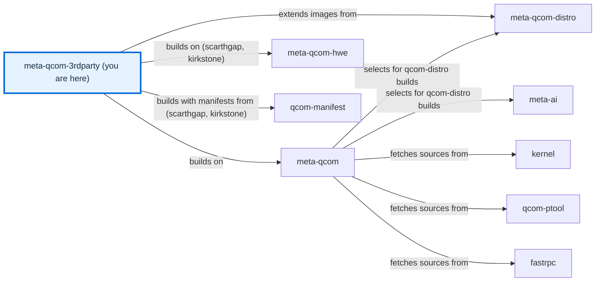

# meta-qcom-3rdparty

[)](https://github.com/qualcomm-linux/meta-qcom-3rdparty/actions/workflows/push.yml)
[)](https://github.com/qualcomm-linux/meta-qcom-3rdparty/actions/workflows/nightly-build.yml)

[)](https://github.com/qualcomm-linux/meta-qcom-3rdparty/actions/workflows/push.yml?query=branch%3Awrynose)
[)](https://github.com/qualcomm-linux/meta-qcom-3rdparty/actions/workflows/nightly-build.yml?query=branch%3Awrynose)

## Introduction

OpenEmbedded/Yocto Project BSP layer for Third-Party Maintained Qualcomm based
platforms.

This layer provides additional recipes and machine configuration files for
Third-Party Maintained Qualcomm platforms. Reference boards that are officially
supported by Qualcomm are available via [`meta-qcom`](https://github.com/qualcomm-linux/meta-qcom) instead.

This layer depends on:

```text
URI: https://github.com/openembedded/openembedded-core.git
layers: meta
branch: master
revision: HEAD

URI: https://github.com/qualcomm-linux/meta-qcom.git
branch: master
revision: HEAD
```

## Branches

| Branch | Purpose | Status | Build from it | Contributions |
| --- | --- | --- | --- | --- |
| `main` | Primary development branch, with focus on upstream support and compatibility with the most recent Yocto Project release. | Development branch; [last change](https://github.com/qualcomm-linux/meta-qcom-3rdparty/commits/main) 2026-09-30 | Yes: [the layer's machines](conf/machine/) | Upstream-baseline changes ([contribution guide](docs/source/contributing/CONTRIBUTING.md#3--upstream-baseline)) |
| `wrynose` | LTS branch based on the Yocto Project 6.0 release, used by Qualcomm Linux 2.x. | Release branch; Yocto Project 6.0 is supported until April 2030 ([releases](https://wiki.yoctoproject.org/wiki/Releases)) | Yes: the same machines as `main` | Backports from `main`, or changes that apply only to `wrynose` ([contribution guide](docs/source/contributing/CONTRIBUTING.md#29--release-branches)) |
| `scarthgap` | Qualcomm Linux >= 1.4, aligned with Yocto Project 5.0 (LTS). | Not documented; Yocto Project 5.0 is supported until April 2028 ([releases](https://wiki.yoctoproject.org/wiki/Releases)); [last change](https://github.com/qualcomm-linux/meta-qcom-3rdparty/commits/scarthgap) 2025-09-03 | No: the branch holds only `conf/layer.conf` and CI configuration, so it has no board support to build | Qualcomm Linux 1.x downstream-baseline changes ([contribution guide](docs/source/contributing/CONTRIBUTING.md#4--downstream-baseline--qualcomm-linux-1x)) |
| `kirkstone` | Qualcomm Linux <= 1.3, aligned with Yocto Project 4.0 (LTS). | Not documented; Yocto Project 4.0 is end of life ([releases](https://wiki.yoctoproject.org/wiki/Releases)); [last change](https://github.com/qualcomm-linux/meta-qcom-3rdparty/commits/kirkstone) 2025-04-09 | No: the branch holds only `conf/layer.conf` and CI configuration | Not documented; [SECURITY.md](SECURITY.md#branches-maintained-with-security-fixes) accepts patches only for the LTS releases and `main` |
| `next` | Not documented | Not documented; [last change](https://github.com/qualcomm-linux/meta-qcom-3rdparty/commits/next) 2026-08-20 | Not documented; its tree has machine configurations for radxa-dragon-q6a, uno-q, and ventuno-q | Not documented |

[BRANCHES.md](BRANCHES.md) describes how the branches relate to `main`.

## Machine Support

See [`conf/machine`](conf/machine/README.md) for the complete list of supported devices.

## Documentation

Build an image for a board with the [build tutorial](docs/source/user/USAGE.md),
which runs `kas-container build ci/rubikpi3.yml`. The
[configuration reference](docs/source/user/CONFIGURATION.md) explains the layer's
settings, and the [function reference](docs/source/contributing/README.md#function-reference)
is generated from the comments in its scripts and recipes.

Build the documentation site with `make -f docs/source/Makefile setup html` from
the repository root, then open `docs/site/index.html` directly in a browser. The
[documentation guide](docs/README.md) links the prerequisites, and the
[development guide](docs/source/contributing/DEVELOPMENT.md) covers checking a
change.

## Contributing

Please read [docs/source/contributing/CONTRIBUTING.md](docs/source/contributing/CONTRIBUTING.md) for the contribution
workflow, the layer scope rules and the commit subject and message
requirements before opening a pull request.

## Communication

- **GitHub Issues:** [meta-qcom-3rdparty issues](https://github.com/qualcomm-linux/meta-qcom-3rdparty/issues)
- **Pull Requests:** [meta-qcom-3rdparty pull requests](https://github.com/qualcomm-linux/meta-qcom-3rdparty/pulls)

## Maintainer(s)

- Ricardo Salveti <ricardo.salveti@oss.qualcomm.com>
- Nicolas Dechesne <nicolas.dechesne@oss.qualcomm.com>

## License

This layer is licensed under the MIT license. Check out [LICENSE](LICENSE)
for more details.

## Folders

- [.github/](.github/) — Holds the [CODEOWNERS](.github/CODEOWNERS), the [issue templates](.github/ISSUE_TEMPLATE/) and [pull request template](.github/PULL_REQUEST_TEMPLATE/pr_template.md), the [CI workflows](.github/workflows/), the Markdown lint rules, and the documentation build's scripts.
- [ci/](ci/README.md) — Holds the kas files and helper scripts for builds and checks.
- [conf/](conf/README.md) — Holds the layer and machine configuration.
- [docs/](docs/README.md) — Holds the documentation source and explains how to build the site.
- [dynamic-layers/](dynamic-layers/README.md) — Holds files applied only when another layer is in the build.
- [recipes-bsp/](recipes-bsp/README.md) — Holds the board firmware recipes and packagegroups.
- [recipes-kernel/](recipes-kernel/README.md) — Holds the kernel recipe appends and configuration.

## Files

- [.env.example](.env.example) — Documents the optional kas-container environment settings and how to load them.
- [.gitignore](.gitignore) — Keeps local environment files and documentation build output out of Git.
- [AGENTS.md](AGENTS.md) — Points automation agents to the agent guide.
- [BRANCHES.md](BRANCHES.md) — Describes how the branches relate to `main`.
- [CLAUDE.md](CLAUDE.md) — Links to `AGENTS.md` for agents that read this name.
- [CODE_OF_CONDUCT.md](CODE_OF_CONDUCT.md) — States the expected behaviour and how to report conduct concerns.
- [CONTRIBUTING.md](CONTRIBUTING.md) — Points to the contribution guide and development setup.
- [LICENSE](LICENSE) — Contains the layer's MIT licence.
- [NOTICE](NOTICE) — Keeps the notices for reused documentation tools and templates.
- [README.md](README.md) — Introduces the layer, its branches, documentation, and contents.
- [SECURITY.md](SECURITY.md) — Explains how to report vulnerabilities.

<!-- repository-map:start -->

## Repository map


```mermaid
flowchart LR
    r0["meta-qcom-3rdparty (you are here)"]
    click r0 href "https://github.com/qualcomm-linux/meta-qcom-3rdparty" _blank
    r1["kernel"]
    click r1 href "https://github.com/qualcomm-linux/kernel" _blank
    r2["meta-ai"]
    click r2 href "https://github.com/qualcomm-linux/meta-ai" _blank
    r3["meta-qcom"]
    click r3 href "https://github.com/qualcomm-linux/meta-qcom" _blank
    r4["meta-qcom-distro"]
    click r4 href "https://github.com/qualcomm-linux/meta-qcom-distro" _blank
    r5["meta-qcom-hwe"]
    click r5 href "https://github.com/qualcomm-linux/meta-qcom-hwe" _blank
    r6["qcom-manifest"]
    click r6 href "https://github.com/qualcomm-linux/qcom-manifest" _blank
    r7["qcom-ptool"]
    click r7 href "https://github.com/qualcomm-linux/qcom-ptool" _blank
    r8["fastrpc"]
    click r8 href "https://github.com/qualcomm/fastrpc" _blank
    r0 -->|"builds on"| r3
    r0 -->|"extends images from"| r4
    r3 -->|"selects for qcom-distro builds"| r4
    r3 -->|"selects for qcom-distro builds"| r2
    r3 -->|"fetches sources from"| r1
    r3 -->|"fetches sources from"| r7
    r3 -->|"fetches sources from"| r8
    r0 -->|"builds on (scarthgap, kirkstone)"| r5
    r0 -->|"builds with manifests from (scarthgap, kirkstone)"| r6
    style r0 fill:#e6f3ff,stroke:#0969da,stroke-width:3px,color:#182c43
```

[Full Qualcomm repository map](https://github.com/devdocsorg/docsgen-map-creation-test).

<!-- Generated from https://github.com/devdocsorg/docsgen-map-creation-test at 5c77294d20e7bcb80411384084c2ec3ec4ac0310; dataset SHA-256: 47356637e054031374da885bc144dc09e9afe61ebd925d9789bb92d6aee8de34. -->

<!-- repository-map:end -->
