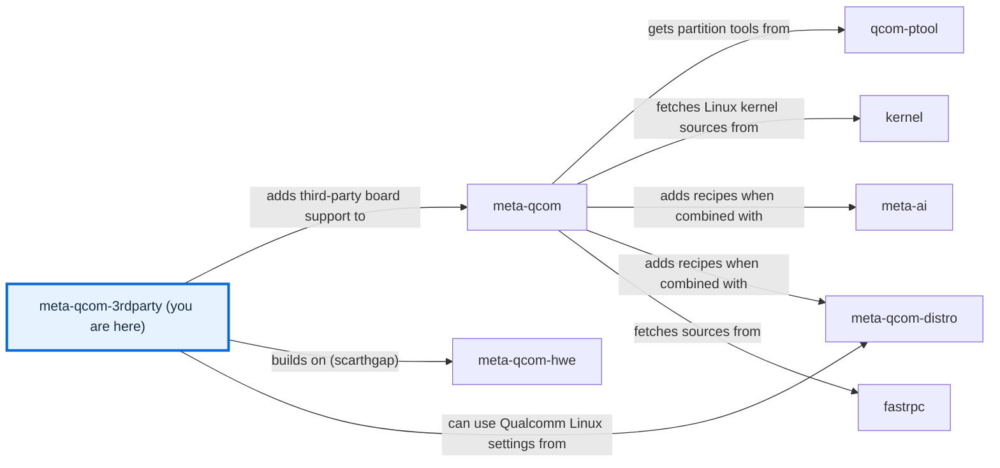

# meta-qcom-3rdparty

[)](https://github.com/qualcomm-linux/meta-qcom-3rdparty/actions/workflows/push.yml)
[)](https://github.com/qualcomm-linux/meta-qcom-3rdparty/actions/workflows/nightly-build.yml)

[)](https://github.com/qualcomm-linux/meta-qcom-3rdparty/actions/workflows/push.yml?query=branch%3Awrynose)
[)](https://github.com/qualcomm-linux/meta-qcom-3rdparty/actions/workflows/nightly-build.yml?query=branch%3Awrynose)

## Introduction

OpenEmbedded/Yocto Project BSP layer for Third-Party Maintained Qualcomm based
platforms.

This layer provides additional recipes and machine configuration files for
Third-Party Maintained Qualcomm platforms. Reference boards that are officially
supported by Qualcomm are available via [meta-qcom](https://github.com/qualcomm-linux/meta-qcom) instead.

To build your first image, follow the [usage tutorial](docs/source/user/USAGE.md).

This layer depends on:

```text
URI: https://github.com/openembedded/openembedded-core.git
layers: meta
branch: master
revision: HEAD

URI: https://github.com/qualcomm-linux/meta-qcom.git
branch: master
revision: HEAD
```

## Branches

| Branch | Purpose | Status | Build from it | Contributions |
| --- | --- | --- | --- | --- |
| **main** | Primary development branch, with focus on upstream support and compatibility with the most recent Yocto Project release. | Active | Yes: the machines in [conf/machine](conf/machine/README.md). | [Upstream Baseline](docs/source/contributing/CONTRIBUTING.md#3--upstream-baseline) |
| **wrynose** | LTS branch based on the Yocto Project 6.0 release, used by Qualcomm Linux 2.x. | Maintained: `main` dispatches its [nightly build](.github/workflows/nightly-build-wrynose.yml) and [backports](.github/workflows/backport.yml) labelled changes; Yocto Project 6.0 has [long-term support until April 2030](https://wiki.yoctoproject.org/wiki/Releases). | Yes: its [machine configurations](https://github.com/qualcomm-linux/meta-qcom-3rdparty/tree/wrynose/conf/machine), built against the `wrynose` branch of [meta-qcom](https://github.com/qualcomm-linux/meta-qcom). | [Branch Destinations](docs/source/contributing/CONTRIBUTING.md#28--branch-destinations) |
| **scarthgap** | Qualcomm Linux >= 1.4, aligned with Yocto Project 5.0 (LTS). | Yocto Project 5.0 has [long-term support until April 2028](https://wiki.yoctoproject.org/wiki/Releases); last commit 2025-09-03. | No: the [branch](https://github.com/qualcomm-linux/meta-qcom-3rdparty/tree/scarthgap) holds only the layer configuration and CI files, with no machines. | [Downstream Baseline](docs/source/contributing/CONTRIBUTING.md#4--downstream-baseline--qualcomm-linux-1x) |
| **kirkstone** | Qualcomm Linux <= 1.3, aligned with Yocto Project 4.0 (LTS). | Outside the patch policy: [SECURITY.md](SECURITY.md#branches-maintained-with-security-fixes) accepts patches only for the LTS releases and `main`, and Yocto Project 4.0 is [end of life](https://wiki.yoctoproject.org/wiki/Releases); last commit 2025-04-09. | No: the [branch](https://github.com/qualcomm-linux/meta-qcom-3rdparty/tree/kirkstone) holds only the layer configuration and CI files, with no machines. | [Branch Destinations](docs/source/contributing/CONTRIBUTING.md#28--branch-destinations) |
| **next** | Not documented. | Outside the patch policy: [SECURITY.md](SECURITY.md#branches-maintained-with-security-fixes) accepts patches only for the LTS releases and `main`. Its [push workflow](https://github.com/qualcomm-linux/meta-qcom-3rdparty/blob/next/.github/workflows/push.yml) builds it; last commit 2026-08-20. | Not documented. Its [tree](https://github.com/qualcomm-linux/meta-qcom-3rdparty/tree/next/conf/machine) holds radxa-dragon-q6a and the uno-q and ventuno-q machines, which `main` dropped when they moved to [meta-qcom-arduino](https://github.com/qualcomm-linux/meta-qcom-arduino). | [Branch Destinations](docs/source/contributing/CONTRIBUTING.md#28--branch-destinations) |

[BRANCHES.md](BRANCHES.md) describes how each branch is maintained and how it
relates to `main`.

## Machine Support

See [conf/machine](conf/machine/README.md) for the complete list of supported devices.

## Documentation

Build the documentation site from the repository root, then open
`docs/site/index.html` directly in a browser:

```sh
make -f docs/source/Makefile setup html
```

- [Usage tutorial](docs/source/user/USAGE.md): build an image for a supported board.
- [Configuration reference](docs/source/user/CONFIGURATION.md): layer, machine, kas, kernel, environment, and CI settings.
- [Development setup](docs/source/contributing/DEVELOPMENT.md): install the tools and run the documentation and layer checks.
- [Function reference](docs/source/contributing/README.md#function-reference): the shell functions and BitBake tasks, generated from their comments.
- [Documentation guide](docs/README.md): where the documentation source lives and how the site is built.

## Contributing

Read [CONTRIBUTING.md](CONTRIBUTING.md) to submit changes, and follow the
[Code of Conduct](CODE_OF_CONDUCT.md).

## Communication

- **GitHub Issues:** [meta-qcom-3rdparty issues](https://github.com/qualcomm-linux/meta-qcom-3rdparty/issues)
- **Pull Requests:** [meta-qcom-3rdparty pull requests](https://github.com/qualcomm-linux/meta-qcom-3rdparty/pulls)

## Maintainer(s)

- Ricardo Salveti <ricardo.salveti@oss.qualcomm.com>
- Nicolas Dechesne <nicolas.dechesne@oss.qualcomm.com>

## License

This layer is licensed under the MIT license. Check out [LICENSE](LICENSE)
for more details.

## Folders

- [.github/](.github/) — Holds the CI workflows, [CODEOWNERS](.github/CODEOWNERS), the [issue templates](.github/ISSUE_TEMPLATE/), the [pull request template](.github/PULL_REQUEST_TEMPLATE/pr_template.md), and the documentation build helpers.
- [ci/](ci/README.md) — Contains the kas build fragments and the CI helper scripts.
- [conf/](conf/README.md) — Holds the layer configuration and the machine configurations.
- [docs/](docs/README.md) — Contains the documentation source and explains how to build the site.
- [dynamic-layers/](dynamic-layers/README.md) — Holds metadata that applies only when another layer is present.
- [recipes-bsp/](recipes-bsp/README.md) — Contains the board firmware and packagegroup recipes.
- [recipes-kernel/](recipes-kernel/README.md) — Contains the kernel recipe append and its configuration fragment.

## Files

- [.env.example](.env.example) — Documents the environment settings that local builds and checks read.
- [.gitignore](.gitignore) — Keeps the documentation environment and generated site out of Git.
- [AGENTS.md](AGENTS.md) — Points automation agents to the agent guide.
- [BRANCHES.md](BRANCHES.md) — Describes how each branch is maintained and how it relates to `main`.
- [CODE_OF_CONDUCT.md](CODE_OF_CONDUCT.md) — States participation standards and how to report conduct concerns.
- [CONTRIBUTING.md](CONTRIBUTING.md) — Points to the contribution guide.
- [LICENSE](LICENSE) — Contains the layer's MIT licence.
- [README.md](README.md) — Introduces the layer, its branches, documentation, and contents.
- [SECURITY.md](SECURITY.md) — Explains how to report vulnerabilities privately.

<!-- repository-map:start -->

## Repository map


```mermaid
flowchart LR
    r0["meta-qcom-3rdparty (you are here)"]
    click r0 href "https://github.com/qualcomm-linux/meta-qcom-3rdparty" _blank
    r1["kernel"]
    click r1 href "https://github.com/qualcomm-linux/kernel" _blank
    r2["meta-ai"]
    click r2 href "https://github.com/qualcomm-linux/meta-ai" _blank
    r3["meta-qcom"]
    click r3 href "https://github.com/qualcomm-linux/meta-qcom" _blank
    r4["meta-qcom-distro"]
    click r4 href "https://github.com/qualcomm-linux/meta-qcom-distro" _blank
    r5["meta-qcom-hwe"]
    click r5 href "https://github.com/qualcomm-linux/meta-qcom-hwe" _blank
    r6["qcom-ptool"]
    click r6 href "https://github.com/qualcomm-linux/qcom-ptool" _blank
    r7["fastrpc"]
    click r7 href "https://github.com/qualcomm/fastrpc" _blank
    r0 -->|"adds third-party board support to"| r3
    r0 -->|"builds on (scarthgap)"| r5
    r0 -->|"can use Qualcomm Linux settings from"| r4
    r3 -->|"gets partition tools from"| r6
    r3 -->|"fetches Linux kernel sources from"| r1
    r3 -->|"adds recipes when combined with"| r2
    r3 -->|"adds recipes when combined with"| r4
    r3 -->|"fetches sources from"| r7
    style r0 fill:#e6f3ff,stroke:#0969da,stroke-width:3px,color:#182c43
```

[Full Qualcomm repository map](https://github.com/devdocsorg/qualcomm-repository-map).

<!-- Generated from https://github.com/devdocsorg/qualcomm-repository-map at 1b87048daaa5d5cc821e4af5839ddf652de85655; dataset SHA-256: aab8b6a697f8d17a248bf3c1b443e432b6a213d357325925c07ac5a2e312b88d. -->

<!-- repository-map:end -->
