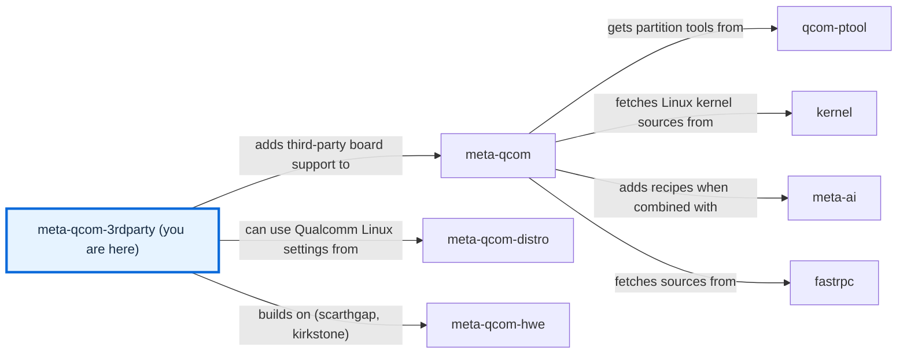

# meta-qcom-3rdparty

[)](https://github.com/qualcomm-linux/meta-qcom-3rdparty/actions/workflows/push.yml)
[)](https://github.com/qualcomm-linux/meta-qcom-3rdparty/actions/workflows/nightly-build.yml)

[)](https://github.com/qualcomm-linux/meta-qcom-3rdparty/actions/workflows/push.yml?query=branch%3Awrynose)
[)](https://github.com/qualcomm-linux/meta-qcom-3rdparty/actions/workflows/nightly-build.yml?query=branch%3Awrynose)

## Introduction

OpenEmbedded/Yocto Project BSP layer for Third-Party Maintained Qualcomm based
platforms.

This layer provides additional recipes and machine configuration files for
Third-Party Maintained Qualcomm platforms. Reference boards that are officially
supported by Qualcomm are available via [`meta-qcom`](https://github.com/qualcomm-linux/meta-qcom) instead.

This layer depends on:

```text
URI: https://github.com/openembedded/openembedded-core.git
layers: meta
branch: master
revision: HEAD

URI: https://github.com/qualcomm-linux/meta-qcom.git
branch: master
revision: HEAD
```

To build an image for a supported board, follow the
[build tutorial](docs/source/user/USAGE.md).

## Branches

- **main:** Primary development branch, with focus on upstream support and
  compatibility with the most recent Yocto Project release. Build from it;
  changes go here.
- **wrynose:** LTS branch based on the Yocto Project 6.0 release, used by
  Qualcomm Linux 2.x. Build from it; changes arrive as backports from `main`.
- **scarthgap:** Qualcomm Linux >= 1.4, aligned with Yocto Project 5.0 (LTS).
  It has no machine configurations to build; the contribution guide sends
  Qualcomm Linux 1.x changes here.
- **kirkstone:** Qualcomm Linux <= 1.3, aligned with Yocto Project 4.0 (LTS),
  now end of life. It has no machine configurations to build; whether it takes
  changes is not documented.
- **next:** Purpose, status, build use, and whether it takes changes are not
  documented. It carries the `uno-q` and `ventuno-q` machines, which `main` does
  not.

[BRANCHES.md](BRANCHES.md) gives each branch's support status and last update.
The [contribution guide](docs/source/contributing/CONTRIBUTING.md) explains how
to send changes.

## Machine Support

See [conf/machine](conf/machine/README.md) for the complete list of supported devices.

## Documentation

Open [docs/site/index.html](docs/site/index.html) directly in a browser for the
generated site; the [documentation guide](docs/README.md) explains how to rebuild it.

- [Build tutorial](docs/source/user/USAGE.md) — Build an image for a supported board with kas.
- [Configuration reference](docs/source/user/CONFIGURATION.md) — Understand the layer, machine, kernel, kas, and CI settings.
- [Development setup](docs/source/contributing/DEVELOPMENT.md) — Install the documentation tools, build the site and function reference, and run the checks.

## Contributing

Read [CONTRIBUTING.md](CONTRIBUTING.md) for where and how to submit changes, and
follow the [Code of Conduct](CODE_OF_CONDUCT.md) when participating.

## Communication

- **GitHub Issues:** [meta-qcom-3rdparty issues](https://github.com/qualcomm-linux/meta-qcom-3rdparty/issues)
- **Pull Requests:** [meta-qcom-3rdparty pull requests](https://github.com/qualcomm-linux/meta-qcom-3rdparty/pulls)

## Maintainer(s)

- Ricardo Salveti <ricardo.salveti@oss.qualcomm.com>
- Nicolas Dechesne <nicolas.dechesne@oss.qualcomm.com>

## License

This layer is licensed under the MIT license. Check out [LICENSE](LICENSE)
for more details. [NOTICE](NOTICE) keeps the licence notices of the reused
documentation tools and templates.

## Folders

- [.github/](.github/) — Holds [CODEOWNERS](.github/CODEOWNERS), the [workflows](.github/workflows/), the [issue templates](.github/ISSUE_TEMPLATE/), the [pull request template](.github/PULL_REQUEST_TEMPLATE/pr_template.md), the markdownlint configuration, and the documentation helper scripts.
- [ci/](ci/README.md) — Holds the kas configuration files and the CI helper scripts.
- [conf/](conf/README.md) — Holds the layer configuration and the machine definitions.
- [docs/](docs/README.md) — Holds the documentation source and the generated site.
- [dynamic-layers/](dynamic-layers/README.md) — Holds metadata used only when another layer is present.
- [recipes-bsp/](recipes-bsp/README.md) — Holds the board firmware recipes and packagegroups.
- [recipes-kernel/](recipes-kernel/README.md) — Holds the kernel appends and configuration fragments.

## Files

- [README.md](README.md) — Introduces the layer, its branches, and its contents.
- [BRANCHES.md](BRANCHES.md) — Describes the purpose, status, and maintenance of each branch.
- [CONTRIBUTING.md](CONTRIBUTING.md) — Points to the contribution guide and development setup.
- [AGENTS.md](AGENTS.md) — Points automation agents to the agent guide.
- [CODE_OF_CONDUCT.md](CODE_OF_CONDUCT.md) — States participation standards and how to report conduct concerns.
- [SECURITY.md](SECURITY.md) — Explains how to report vulnerabilities privately.
- [LICENSE](LICENSE) — Contains the layer's MIT licence.
- [NOTICE](NOTICE) — Keeps the licence notices of the reused documentation tools and templates.
- [.env.example](.env.example) — Documents the environment settings for kas-container builds.
- [.gitignore](.gitignore) — Keeps the documentation environment and build caches out of commits.

<!-- repository-map:start -->

## Repository map


```mermaid
flowchart LR
    r0["meta-qcom-3rdparty (you are here)"]
    click r0 href "https://github.com/qualcomm-linux/meta-qcom-3rdparty" _blank
    r1["kernel"]
    click r1 href "https://github.com/qualcomm-linux/kernel" _blank
    r2["meta-ai"]
    click r2 href "https://github.com/qualcomm-linux/meta-ai" _blank
    r3["meta-qcom"]
    click r3 href "https://github.com/qualcomm-linux/meta-qcom" _blank
    r4["meta-qcom-distro"]
    click r4 href "https://github.com/qualcomm-linux/meta-qcom-distro" _blank
    r5["meta-qcom-hwe"]
    click r5 href "https://github.com/qualcomm-linux/meta-qcom-hwe" _blank
    r6["qcom-ptool"]
    click r6 href "https://github.com/qualcomm-linux/qcom-ptool" _blank
    r7["fastrpc"]
    click r7 href "https://github.com/qualcomm/fastrpc" _blank
    r0 -->|"adds third-party board support to"| r3
    r0 -->|"builds on (scarthgap, kirkstone)"| r5
    r0 -->|"can use Qualcomm Linux settings from"| r4
    r3 -->|"gets partition tools from"| r6
    r3 -->|"fetches Linux kernel sources from"| r1
    r3 -->|"adds recipes when combined with"| r2
    r3 -->|"fetches sources from"| r7
    style r0 fill:#e6f3ff,stroke:#0969da,stroke-width:3px,color:#182c43
```

[Full Qualcomm repository map](https://github.com/devdocsorg/qualcomm-repository-map).

<!-- Generated from https://github.com/devdocsorg/qualcomm-repository-map at 75c8e89d84828a3017bd7ee3e2255165fe6c4c50; dataset SHA-256: 02fba6d3ba3771d14d25408ee0765015eae386f59d5abbdf28a5249deaeff2e1. -->

<!-- repository-map:end -->
