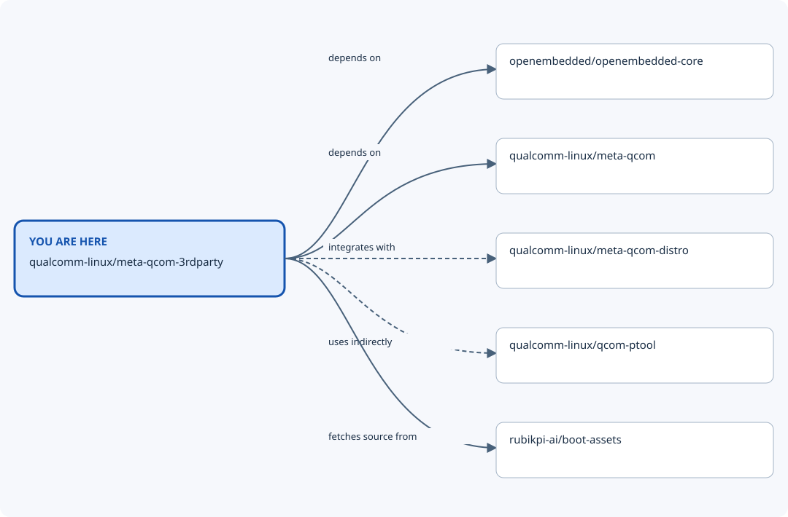

# Repository map: qualcomm-linux/meta-qcom-3rdparty

**You are here:** `qualcomm-linux/meta-qcom-3rdparty`. This view shows recorded nearby repositories, including
both incoming and outgoing relationships. The diagram prioritises software/build
connections when present; the table also records shared automation. Dashed lines mean optional or indirect
relationships; the table states when each connection applies.

| From | Relationship | To | When it applies | Evidence |
| --- | --- | --- | --- | --- |
| qualcomm-linux/meta-qcom-3rdparty | depends on | openembedded/openembedded-core | wrynose-compatible main snapshot 8927b428bcae; required layer collection. | [1](https://github.com/qualcomm-linux/meta-qcom-3rdparty/blob/8927b428bcaea0c47186beeb9d9446061c785e9c/conf/layer.conf) |
| qualcomm-linux/meta-qcom-3rdparty | uses automation from | qualcomm-linux/bitbake-lint-action | GitHub Actions integration at the evidence revision; workflow/action refs are specified by the calling files. This is not a runtime dependency. | [1](https://github.com/qualcomm-linux/meta-qcom-3rdparty/blob/8927b428bcaea0c47186beeb9d9446061c785e9c/.github/workflows/bitbake-lint.yml) |
| qualcomm-linux/meta-qcom-3rdparty | uses automation from | qualcomm-linux/github-action-matrix-outputs-read | GitHub Actions integration at the evidence revision; workflow/action refs are specified by the calling files. This is not a runtime dependency. | [1](https://github.com/qualcomm-linux/meta-qcom-3rdparty/blob/8927b428bcaea0c47186beeb9d9446061c785e9c/.github/workflows/test-distro.yml) |
| qualcomm-linux/meta-qcom-3rdparty | uses automation from | qualcomm-linux/github-action-matrix-outputs-write | GitHub Actions integration at the evidence revision; workflow/action refs are specified by the calling files. This is not a runtime dependency. | [1](https://github.com/qualcomm-linux/meta-qcom-3rdparty/blob/8927b428bcaea0c47186beeb9d9446061c785e9c/.github/workflows/test-distro.yml) |
| qualcomm-linux/meta-qcom-3rdparty | depends on | qualcomm-linux/meta-qcom | wrynose-compatible main snapshot 8927b428bcae; required layer collection. | [1](https://github.com/qualcomm-linux/meta-qcom-3rdparty/blob/8927b428bcaea0c47186beeb9d9446061c785e9c/conf/layer.conf) |
| qualcomm-linux/meta-qcom-3rdparty | uses automation from | qualcomm-linux/meta-qcom | GitHub Actions integration at the evidence revision; workflow/action refs are specified by the calling files. This is not a runtime dependency. | [1](https://github.com/qualcomm-linux/meta-qcom-3rdparty/blob/8927b428bcaea0c47186beeb9d9446061c785e9c/.github/workflows/build-yocto.yml) · [2](https://github.com/qualcomm-linux/meta-qcom-3rdparty/blob/8927b428bcaea0c47186beeb9d9446061c785e9c/.github/workflows/build-yocto.yml) · [3](https://github.com/qualcomm-linux/meta-qcom-3rdparty/blob/8927b428bcaea0c47186beeb9d9446061c785e9c/.github/workflows/test-distro.yml) · [4](https://github.com/qualcomm-linux/meta-qcom-3rdparty/blob/8927b428bcaea0c47186beeb9d9446061c785e9c/.github/workflows/test-distro.yml) · [5](https://github.com/qualcomm-linux/meta-qcom-3rdparty/blob/8927b428bcaea0c47186beeb9d9446061c785e9c/.github/workflows/test-distro.yml) |
| qualcomm-linux/meta-qcom-3rdparty | integrates with | qualcomm-linux/meta-qcom-distro | Optional: the dynamic layer applies only when qcom-distro is present. | [1](https://github.com/qualcomm-linux/meta-qcom-3rdparty/blob/8927b428bcaea0c47186beeb9d9446061c785e9c/conf/layer.conf) |
| qualcomm-linux/meta-qcom-3rdparty | uses indirectly | qualcomm-linux/qcom-ptool | Partition tooling is supplied through meta-qcom; this is an indirect relationship, not an extra layer dependency. | [1](https://github.com/qualcomm-linux/meta-qcom/blob/c6729710f055e1c0337c830030ab25eef7f293a5/recipes-bsp/partition/qcom-ptool.inc) · [2](https://github.com/qualcomm-linux/meta-qcom-3rdparty/blob/8927b428bcaea0c47186beeb9d9446061c785e9c/conf/machine/rubikpi3.conf) |
| qualcomm-linux/meta-qcom-3rdparty | uses automation from | qualcomm/qcom-reusable-workflows | GitHub Actions integration at the evidence revision; workflow/action refs are specified by the calling files. This is not a runtime dependency. | [1](https://github.com/qualcomm-linux/meta-qcom-3rdparty/blob/8927b428bcaea0c47186beeb9d9446061c785e9c/.github/workflows/qcom-preflight-checks.yml) |
| qualcomm-linux/meta-qcom-3rdparty | fetches source from | rubikpi-ai/boot-assets | RUBIK Pi 3 boot firmware only; pinned by the recipe SRCREV. | [1](https://github.com/qualcomm-linux/meta-qcom-3rdparty/blob/8927b428bcaea0c47186beeb9d9446061c785e9c/recipes-bsp/firmware-boot/firmware-qcom-boot-rubikpi3_20260621.bb) |

## Nearby repositories

- [openembedded/openembedded-core](https://github.com/openembedded/openembedded-core) — Base OpenEmbedded recipes and classes.
- [qualcomm-linux/bitbake-lint-action](https://github.com/qualcomm-linux/bitbake-lint-action) — GitHub Action for linting bitbake recipes using oelint-adv linter
- [qualcomm-linux/github-action-matrix-outputs-read](https://github.com/qualcomm-linux/github-action-matrix-outputs-read) — Workaround implementation - Read matrix jobs outputs
- [qualcomm-linux/github-action-matrix-outputs-write](https://github.com/qualcomm-linux/github-action-matrix-outputs-write) — Workaround implementation - Write matrix jobs outputs
- [qualcomm-linux/meta-qcom](https://github.com/qualcomm-linux/meta-qcom) — OpenEmbedded/Yocto Project BSP layer for Qualcomm based platforms
- [qualcomm-linux/meta-qcom-3rdparty](https://github.com/qualcomm-linux/meta-qcom-3rdparty) — OpenEmbedded/Yocto Project BSP layer for Third-Party Maintained Qualcomm based platforms
- [qualcomm-linux/meta-qcom-distro](https://github.com/qualcomm-linux/meta-qcom-distro) — OpenEmbedded/Yocto Project Reference Distribution layer for Qualcomm based platforms
- [qualcomm-linux/qcom-ptool](https://github.com/qualcomm-linux/qcom-ptool) — qcom-ptool contains various device partitioning utilities like ptool.py, gen_partitions.py and various sample partition configuration files needed for Qualcomm SoCs.
- [qualcomm/qcom-reusable-workflows](https://github.com/qualcomm/qcom-reusable-workflows) — Qualcomm reusable workflows
- [rubikpi-ai/boot-assets](https://github.com/rubikpi-ai/boot-assets) — Vendor-hosted RUBIK Pi boot firmware consumed by the board recipe.

## Full ecosystem map

Return to the [Qualcomm repository map](https://github.com/devdocsorg/qualcomm-repository-map) for the wider ecosystem,
other nearby views, and the locally browsable site. Relationship claims apply to
the linked evidence revisions; use release-compatible revisions for a build.

Generated from `data/repositories.json` (SHA-256 `602a68056238817dccee9f98db5c06ea20d0bb165a53a0c23ff2d0423240dfca`).
Source: [central map revision `823a772ba747`](https://github.com/devdocsorg/qualcomm-repository-map/tree/823a772ba747fc220b79ffdef57acd65d3d7703c).
Edit the shared dataset and regenerate this view to change relationships.
